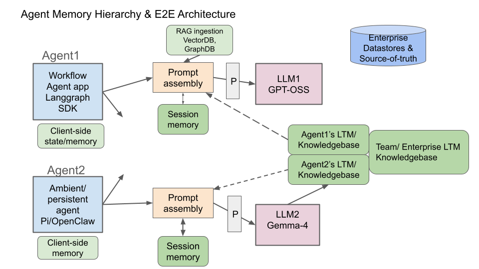

# AI 에이전트를 위한 메모리 아키텍처 설계

1. [추론 서비스 상에 메모리](architect_memory_for_ai_agents.md#1-추론-서비스-상에-메모리)<br>
2. [현재 추론 서비스](architect_memory_for_ai_agents.md#2-현재-추론-서비스)<br>
3. [용어 및 E2E 아키텍처 예시](architect_memory_for_ai_agents.md#3-용어-및-e2e-아키텍처-예시)<br>
4. [관련 분야의 커뮤니티 및 오픈 소스 프로젝트](architect_memory_for_ai_agents.md#4-관련-분야의-커뮤니티-및-오픈-소스-프로젝트)<br>
5. [OpenClaw와 Mem0 메모리 예제](architect_memory_for_ai_agents.md#5-openclaw와-mem0-메모리-예제)<br>
6. [요약 및 참조](architect_memory_for_ai_agents.md#6-요약-및-참조)<br>
<br>
<br>

## 1. 추론 서비스 상에 메모리

### 1.1 LLM과 에이전트의 메모리

### 1.1.1 LLM의 휘발성 메모리

LLM(학습 라이프사이클 관리자)과의 모든 세션에서 매번 대화가 처음부터 다시 시작하는 것처럼 느껴진 경우가 있습니다. LLM에는 한 가지 문제가 있는데, 바로 휘발성 기억력라는 점입니다. 이 번 블로그에서는 그 해결책, 바로 에이전트 메모리에 대해 살펴보겠습니다.

#### 1.1.2 에이전트 메모리

에이전트 메모리 시스템은 에이전트 추론 시스템이 과거 상호 작용, 축적된 지식 및 학습된 선호도를 불러올 수 있도록 영구적이고 검색 가능한 저장소를 제공합니다. 이는 기본적인 컨텍스트 엔지니어링 및 검색 증강 생성과 같은 관련 기술을 뛰어넘는 기능입니다.

2025년과 2026년 내내 에이전트 메모리는 AI 연구소와 벤더 전반에 걸쳐 중요한 연구 분야로 떠올랐습니다. 스탠포드 [메타 하네스 논문](https://arxiv.org/abs/2603.28052), 카네기 멜론 대학교의 [외부화 논문](https://arxiv.org/abs/2604.08224), 안드레이 카르파티의 [LLM 위키 프로젝트](https://gist.github.com/karpathy/442a6bf555914893e9891c11519de94f), 그리고 구글의 [시뮬라크라 논문](https://research.google/pubs/generative-agents-interactive-simulacra-of-human-behavior/)과 같은 초기 에이전트 메모리 관련 연구 등 최근 연구 및 프로젝트에서 공통적으로 나타나는 주제는 다음과 같이 요약할 수 있습니다.
```
에이전트 기능 != 단순히 모델 가중치만을 의미

에이전트 기능 = 모델 + 활용 수단(harness) + 메모리 + 환경 + 진화
```
<br>

### 1.2 기업들 현황

#### 1.2.1 기업들의 에이전트 메모리 기술

초기 연구 결과에 따르면, 적절한 하네스, 메모리 및 시스템 구현을 갖춘 평균 크기의 모델이 제대로 된 하네스와 메모리 시스템이 부족한 더 큰 크기의 모델보다 훨씬 뛰어난 성능을 보일 수 있습니다. 특히 메모리는 장시간 실행되는 작업에서 지속적인 자체 학습을 가능하게 하고, 궁극적으로 다중 에이전트 군집 학습 및 "엔터프라이즈 마인드" 시스템으로 나아가기 위한 핵심 요소입니다. 

따라서 대부분의 주요 벤더들이 에이전트 메모리 관련 제품과 기능을 출시하고 있는 것은 당연한 일입니다.
* Anthropic의 관리형 에이전트 API 내의 [Memory 및 Dreaming 제품](https://youtu.be/RtywqDFBYnQ?si=CapThW07W-Z-HqHs)
* Langgraph의 [에이전트 하네스 메모리](https://www.langchain.com/blog/your-harness-your-memory)
* [OpenClaw의 메모리 기능](https://docs.openclaw.ai/concepts/memory)

레드햇은 업계의 다른 기업들과 마찬가지로 이러한 기술들이 미래 AI 기반 엔터프라이즈의 핵심 구성 요소라고 생각하고 있습니다.

#### 1.2.2 블로그 내 주요 주제

* 현재 추론 아키텍처의 메모리 관련 문제점
* 에이전트 메모리에 대한 엔드투엔드 시스템 아키텍처 및 용어
* 기존 오픈 소스 프로젝트에 대한 간략한 개요
* 에이전트 메모리를 사용하는 OpenClaw 에이전트의 초기 배포 예제
<br>
<br>

## 2. 현재 추론 서비스

### 2.1 근본적으로 상태를 저장하지 않는 LLM 추론 서비스

* 각 입력 프롬프트는 출력 응답을 생성하며, 모델은 변경되지 않고 상호 작용에 대한 정보가 저장되지 않음
* 이러한 상태 비저장성은 재현성 및 단순성과 같은 이점을 제공하지만, 상당한 어려움을 야기함
<br>

### 2.2 메모리-리스 추론 서비스 문제점

* 계산 비효율성
  + 모든 쿼리를 처음부터 다시 계산
  + 유사한 계산을 반복해서 수행하는 것은 AI 하드웨어의 비효율적인 사용 방식

* 컨텍스트 창 제한 사항
  + 여러 턴이 반복되는 긴 대화, 에이전트 기반 워크플로, 장시간 실행되는 작업에는 긴 컨텍스트가 필요하며, 각 프롬프트에 전체 채팅 기록을 다시 입력 필요
  + 컨텍스트가 커질수록 모델은 어텐션 오류와 '컨텍스트 노후화' 문제를 겪게 되며, 동시에 키-값 캐시 연산 비용이 크게 증가

* 추론 간 장기적인 학습이 불가능
  + 모델은 전체 재학습 없이는 배포 경험을 통해 스스로 개선할 수 없음

* 고립된 에이전트
  + 에이전트 간 지식 공유 또는 군집 지능을 위한 메커니즘이 없음

* 지식 기반 구축 없음
  + 추론된 지식과 기억을 사용하여 지속적인 지식 기반이 구축되지 않음

> [!NOTE]
> 컨텍스트 엔지니어링 기법(예: 압축, 필터링, 검색 증강 생성, 캐싱)은 이러한 문제를 완화하는 데 도움이 되지만, 근본 원인이 아닌 증상만을 다룹니다. 에이전트 메모리 시스템, 즉 에이전트가 추론을 강화하기 위해 메모리를 생성, 관리 및 검색할 수 있도록 하는 인프라는 보다 근본적인 해결책을 제시합니다.
<br>
<br>

## 3. 용어 및 E2E 아키텍처 예시

블로그에서는 용어를 정립하고 다양한 접근 방식에 대한 아키텍처적 맥락을 제공하기 위해 샘플 엔드투엔드 아키텍처를 간략하게 설명합니다. 이는 예시일 뿐이며, 반드시 따라야 하는 것은 아닙니다. 유효한 아키텍처는 다양하게 존재합니다.

> [!NOTE]
> 달리 명시되지 않는 한, "에이전트"는 추론 시스템과 상호 작용하는 사람 사용자 및 에이전트 애플리케이션 모두를 의미합니다.

### 3.1 클라이언트 & 서버 단 에이전트 메모리

* 클라이언트 측 에이전트 메모리
  + 에이전트 전용이며 에이전트가 직접 관리
  + 예) 개발자의 개인 OpenAI 어시스턴트가 생성하는 메모리

* 서버 측 에이전트 메모리
  + 공급자가 관리
  + 다중 에이전트 학습, 엔터프라이즈 데이터 거버넌스, 보안, 감사, 버전 관리 및 콘텐츠 속성 부여 기능을 제공
<br>

### 3.2 메모리 유형 (일반적인 분류)

* 세션 메모리
  + 단일 에이전트-LLM 세션 내의 질의 및 응답 기록을 모두 포함
  + 수명은 하나의 세션으로 제한
  + 예) OpenAI [Responses API 대화 상태 관리 구현](https://developers.openai.com/api/docs/guides/conversation-state)

* 장기 파일 시스템 메모리
  + 파일 시스템에 파일 형태로 저장되는 메모리로, 종종 추가적인 인덱싱 기능을 포함
  + 에이전트 런타임이 디렉터리 구조를 자연스럽게 탐색하기 때문에 효과적

* 장기 에피소딕 메모리
  + 사건과 시간적 순서를 중심으로 구성된 지속적인 메모리
  + 개별 세션 기간을 넘어 오래 지속됨

* 장기 시만틱 메모리
  + 의미 검색 및 추출을 가능하게 하기 위해 임베딩을 사용하여 저장된 영구 메모리
  + 일반적으로 그래프 메타데이터 및 인덱싱으로 보강된 벡터 데이터베이스에 저장

> [!NOTE]
> 이 주제는 여기서 다루는 것보다 훨씬 광범위합니다. 다양한 변경 패턴, 접근 패턴 등에 따라 여러 가지 메모리 유형이 존재합니다. 이 주제에 대한 보다 완전한 논의는 시간적 범위, 인지 유형, 저장 유형, 기능 유형과 같은 여러 차원에 따른 메모리 분류를 포함해야 합니다.
<br>

### 3.3 샘플 E2E 아키텍처

다양한 에이전트 유형이 메모리 인프라를 공유하면서 LLM 인스턴스와 상호 작용하는 다중 에이전트 시스템


### 3.4 샘플의 주요 아키텍처 흐름

#### 3.4.1 프롬프트 어셈블리

제공되는 각 모델에는 다음 소스에서 컨텍스트를 집계하는 자체 프롬프트 어셈블리 기능이 있음
* 세션 메모리 (대화 기록)
* RAG로 수집된 데이터 (VectorDB, GraphDB)
* 메모리 파일 시스템의 장기 기억(LTM), 의미 기억
* 엔터프라이즈 데이터 저장소 및 진실의 원천

> [!NOTE]
> 프롬프트 생성(및 이 아키텍처의 다른 기능들)은 클라이언트 측, 서버/제공자 측, 또는 양쪽 모두에서 구현할 수 있습니다. 앞서 언급했듯이, 이 아키텍처는 클라이언트 중심 솔루션, 제공자 중심 솔루션, 또는 이 둘의 조합으로 구현할 수 있는 개념을 설명하기 위한 예시입니다.

#### 3.4.2 추론

구성된 프롬프트는 에이전트가 선택한 LLM으로 전송

#### 3.4.3 메모리 기록

* 추론 후, 새로운 메모리가 장기 메모리(LTM)에 기록됨
* 다양한 에이전트 메모리 프레임워크는 메모리 생성 및 기록 시점과 방식에 대한 여러 옵션을 제공
  + 예1) 클라이언트와 LLM 간의 질의응답 흐름을 투명하게 가로채는 방식으로 암묵적으로 수행
  + 예2) 각 질의/응답 시퀀스 후에 클라이언트 또는 공급자가 명시적으로 제어하고 메모리 관련 도구와 기술을 사용하여 수행

#### 3.4.4 계층적 메모리 구조

* 에이전트별 LTM
  + 개별 에이전트에게만 공개
  + 예) 에이전트1의 LTM, 에이전트2의 LTM

* 공유 LTM
  + 팀 또는 기업 전체 상담원이 접근할 수 있는 지식 기반

* 계층적 메모리 구조의 장점
  + 개인 맞춤형 학습과 집단 학습 모두를 가능
  + 두 단계 이상의 계층 구조가 존재 가능
 
> [!NOTE]
> 팀과 기업의 집단 지식이 이러한 방식으로 포착, 유지 및 공유될 때 어떤 가능성이 열릴지 생각해 보십시오. 새로운 사람이나 디지털 작업자가 팀에 합류하면 즉시 팀의 기존 집단 지식에 접근하여 기여를 시작할 수 있습니다. 팀에서 개별 작업자가 이탈하더라도 그들의 지식이 이러한 팀 기억 또는 집단 두뇌에 통합되어 있다면 그 영향은 최소화될 것입니다. 우리는 사람과 에이전트 작업자의 지식이 미래의 계층적 "기업 마인드 아키텍처"로 어떻게 체계화되는지 알 수 있습니다.

#### 3.4.5 데이터 분리

* 에이전트 메모리는 엔터프라이즈의 데이터 소스 데이터베이스와 완전히 분리되어 있음
* 에이전트 메모리 작업에 의해 엔터프라이즈 데이터베이스가 수정되지 않음

#### 3.4.6 배경 기억 유지 및 꿈꾸기(Dreaming)

**"꿈꾸기(Dreaming)"**
* 프레임워크 종속 프로세스는 다음을 수행
  + 장기 기억(LTM)을 지속적으로 처리, 관리 및 최적화
  + 이를 통해 중복을 줄이고, 오래된 기억을 제거하고, 새로운 기억 연관성을 형성하고, 새로운 지식을 도출
* 일부 에이전트 기억 솔루션에서는 이를 "꿈꾸기"이라 함
* 구현 세부 사항은 프레임워크, 에이전트 런타임 및 배포 패턴에 따라 다름
  
> [!NOTE]
> 이러한 미래 지향적인 기업 두뇌 인프라와 에이전트 기반 메모리에 대한 모든 구상은 다양한 새로운 모니터링, 관리, 검증 및 보안 기능을 필요로 할 뿐만 아니라 기업의 지적 재산과 축적된 기업 내부 지식을 보호하는 데에도 핵심적인 역할을 할 것입니다.
<br>
<br>

## 4. 관련 분야의 커뮤니티 및 오픈 소스 프로젝트

생태계 전반에 걸쳐 명확한 패턴이 나타나고 있습니다. AI 에이전트의 메모리가 단일 기능으로 취급되기보다는 설계, 교체 및 최적화가 가능한 구성 가능한 레이어로 여겨지고 있다는 것입니다. 다음은 이러한 분야에서 진행되는 대표적인 커뮤니티 활동 사례 몇 가지입니다.

### 4.1 [Mem0 프로젝트](https://github.com/mem0ai/mem0)

* 다음 역할을 하는 AI 비서 및 에이전트를 위한 메모리 레이어 구축에 중점
  + 대화에서 유용한 정보를 자동으로 추출/저장/정리
  + 해당 내용을 세션 간에 다음 프롬프트에 다시 입력할 수 있도록 불러옴

* 에이전트 하네스 스킬 사용 여부와 관계없이 다양한 메모리 추출 옵션을 제공
  + 이러한 기능은 인라인 에이전트 추론과 비동기적으로 작동

* [Mem0의 벤치마크 성능](https://mem0.ai/blog/mem0-the-token-efficient-memory-algorithm)
  |벤치마크     |기존 알고리즘|신규 알고리즘|질의 별 평균 토큰 수|
  |:---       |:---:    |:---:     |:---:|
  |LoCoMo     |71.4     |91.6      |6,956|
  |LongMemEval|67.8     |93.4      |6,787|
  |BEAM (1M)  |—        |64.1      |6,719|
  |BEAM (10M) |—        |48.6      |6,914|

> [!NOTE]
> Mem0 오픈 소스 프로젝트는 로컬 AI 환경뿐만 아니라 Mem0 클라우드 플랫폼을 통해서도 여러 에이전트 하네스의 메모리 플러그인으로 배포할 수 있습니다.
<br>

### 4.2 OpenClaw 에이전트 프로젝트의 [사용자 정의 메모리 아키텍처](https://docs.openclaw.ai/concepts/memory)

* 내장된 에이전트 메모리 기능과 외부 메모리 공급자(mem0 등)를 플러그인할 수 있는 옵션을 모두 갖춘 사용자 정의 가능한 메모리 아키텍처
* OpenClaw의 내장 메모리는 파일 기반이며 명시적
  + 에이전트는 주로 워크스페이스에 플레인 형태의 Markdown을 써서 "기억"
  + 주로 *MEMORY.md* 파일이며, 지속적인 사실 관계 및 일일 메모를 위해 *memory/YYYY-MM-DD.md* 형태로 저장
* 런타임 시, 활성 메모리 플러그인(기본값으로 *memory-core*)은 해당 파일에에 대하여 키워드 검색 및 선택적 벡터 검색을 사용하는 *memory_search*와 *memory_get*을 제공
* 대화를 압축하기 전에 OpenClaw는 중요한 컨텍스트가 손실되지 않도록 자동 "메모리 플러시" 과정을 실행
* 선택적 "꿈꾸기(dreaming)" 파이프라인은 나중에 단기 메모를 더 중요한 장기 메모리로 통합
* 플러그인 아키텍처는 외부 플러그인이 추가적인 에이전트 메모리 기능을 제공할 수 있도록 지원
<br>

### 4.3 Claude 에이전트 프로젝트

* [Claude Code](https://code.claude.com/docs/en/memory), [Codex](https://developers.openai.com/codex/memories), [Letta](https://developers.openai.com/codex/memories), [Mastra](https://mastra.ai/docs/memory/overview) 등 많은 코딩 에이전트들은 코딩 작업뿐 아니라 일반적인 작업에도 활용될 수 있도록 메모리 아키텍처를 개발해 옴
  + 잘 설계된 메모리 아키텍처는 코딩 워크플로우에 매우 중요
  + 코딩 워크플로우에서 이러한 에이전트들은 저장소 구조, 이전 디버깅 시도, 코딩 선호도, 여러 세션에 걸쳐 수행되는 장기 실행 작업 등을 기억해야 하는 경우가 많음
  + 이러한 장기-메모리(LTM) 기능은 에이전트를 보다 일반적인 워크플로우에 적용할 때 큰 장점이 됨
  
* Claude 에이전트 메모리 기술
  + 단순한 에이전트 메모리의 초기 형태라고 볼 수 있는 [CLAUDE.md](https://support.claude.com/en/articles/14553240-give-claude-context-claude-md-and-better-prompts) 파일로 시작
  + Claude(및 기타 유사한 코딩 에이전트)는 이제 [고급 메모리 및 기억 저장 기능](https://www.youtube.com/watch?v=RtywqDFBYnQ)을 도입하고 있음
<br>

### 4.4 [안드레이 카르파티](https://karpathy.ai/)의 [LLM-Wiki 프로젝트](https://gist.github.com/karpathy/442a6bf555914893e9891c11519de94f)에서 파생된 프로젝트

* 이 프로젝트들은 위키 스타일의 지식 조직을 언어 모델과 에이전트를 위한 장기 기억 시스템으로 활용하는 아이디어를 탐구
* 원시 데이터가 입력되면, 연결된 노트로 구성된 위키와 유사한 파생 메모리 기반으로 "컴파일"
  + 이러한 노트는 큐레이션, 발전, 그리고 위키 탐색 기능을 갖춘 에이전트가 활용할 수 있도록 제공
* 이 프로젝트의 관심은 유사하거나 상호 보완적인 프로젝트들의 생태계를 조성
  + 예) [Graphify](https://graphify.net/)와 [Graphiti](https://github.com/getzep/graphiti)는 위키 노트뿐 아니라 원시 데이터로부터 보다 구조화되고 기계 지향적인 그래프 데이터베이스를 생성하는 도구
<br>

### 4.5 주목할 만한 다른 프로젝트

* 프로젝트 리스트
  + [agentmemory](https://github.com/rohitg00/agentmemory)
  + [OpenViking](https://github.com/volcengine/OpenViking)
  + [MemoryHub](https://github.com/redhat-ai-americas/memory-hub)
  + [Zep/Graphiti](https://github.com/getzep/zep)
  + [Honcho](https://github.com/plastic-labs/honcho)

* 모두 영구적인 에이전트 메모리와 장기적인 컨텍스트 관리를 위한 다양한 추상화 방식을 탐구
* 이러한 프로젝트들은 개인용 AI와 기업용 AI 중 어느 쪽에 초점을 맞추는지 따라 다름
  + 배포 옵션, 에이전트 메모리의 세분성 및 유형, 기업 보안, 그리고 거버넌스 보안 기능에서 차이가 있음
  + 상당수는 아직 실험 단계
  
> [!NOTE]
> 상당수의 프로젝트들이 아직 실험 단계이지만, 이들을 통해, 오픈 소스 커뮤니티가, "AI 에이전트를 더욱 상태 저장 가능하게 만들고 개인용 AI는 물론 새롭게 부상하는 기업 수준의 에이전트 AI를 위해 더욱 풍부한 메모리 기능을 추가하는 과제를 얼마나 빠르게 해결"해 나가고 있는지를 보여줍니다.
<br>
<br>

## 5. OpenClaw와 Mem0 메모리 예제

테스트 예제는 [OpenClaw의 메모리 데모](https://github.com/redhat-et/openclaw-mem-demo/tree/main) 예제를 사용하였습니다.

### 5.1 OpenClaw의 마크다운 파일

* OpenClaw는 세션 간에 유지되는 일련의 마크다운 파일이라는 기본적인 메모리 솔루션을 기본적으로 제공
  + 이 파일들은 시작 시 컨텍스트에 로드
  + 특정 작업 세부 정보보다는 사용자의 신원, 선호도, 그리고 OpenClaw 자체의 특성을 기억하는 데 중점

* 에이전트는 이러한 메모리 파일을 업데이트 가능
  + 그러나, 업데이트 여부를 선택하거나 기억 필요
  + 이러한 판단이 얼마나 달라질 수 있는지 보여주기 위해, 각 턴마다 추출 파이프라인을 실행하는 Mem0 플러그인과 OpenClaw를 나란히 비교 테스트
<br>

### 5.2 에이전트에게 두 세션으로 구성된 작업을 부여

#### 5.2.1 작업 내용

* 작업 
  + 무료 날씨 API를 조사하고 '비콘(Beacon)'이라는 취미 프로젝트에 적합한 API를 추천
  + 다음, 새 세션을 시작하여 이전 세션에서 중단된 부분부터 이어서 진행
* 동일한 스크립트를 사용했지만 구성은 두 가지
  ```
  현재 이용 가능한 최고의 무료 날씨 API들을 조사하고, 'Beacon'이라는 프로젝트에 가장 적합한 API를 추천해 주세요. 무료 이용 혜택이 풍부하고 사용하기 쉬운 API를 원합니다.
  ```

#### 5.2.2 [Mem0 플러그인](https://docs.mem0.ai/integrations/openclaw)이 없는 경우

* 첫 번째 세션은 두 경우 모두 동일
  + 상담원은 여러 옵션을 조사
  + 이 후 [Open-Meteo](https://open-meteo.com/) (API 키 필요 없음, 월 30만 회 호출 무료, 오픈 소스)를 선택했고, 구축을 시작해 보겠다고 제안

* 두 번째 세션에서 두 설정의 차이가 발생
  + 기본 설정에서는 상담원이 이전 대화 내용을 기억하지 못함
  + 이 때문에 다음 답변 받음
    ```
    저는 'Beacon 프로젝트'나 저희가 논의했던 API에 대한 기록을 전혀 가지고 있지 않습니다. 제가 알기로는 이번이 저희가 처음으로 대화를 나눈 것입니다.
    ```

#### 5.2.3 [Mem0 플러그인](https://docs.mem0.ai/integrations/openclaw)이 설치된 경우

* 첫 번째 세션은 동일
* 두 번째 세션에서는 컨텍스트를 즉시 인식하고 프로젝트를 스캐폴딩한 다음 실제 API를 대상으로 실행
  ```
  실시간 데이터가 전송 중입니다. 현재 더블린의 기온은 15.6°C이며 흐린 날씨입니다. Beacon은 설치 작업을 완료하고 정상적으로 작동하며 커밋되었습니다.
  ```

#### 5.2.4 테스트 결과 설명

* 테스트 결과를 보면, 바로 영구 메모리가 있는 것과 없는 것의 차이를 알 수 있음
  + 에이전트는 기술적으로 컨텍스트를 저장할 수 있음
  + 이를 통해, 테스트 중에 이름이나 선호도 같은 개인 상세 정보가 유지됨

* 단일 프롬프트 후에 명확한 브리핑을 놓치면, 이러한 판단은 수주간의 작업 과정에서 점점 더 신뢰도를 잃게 됨
  + Mem0은 이러한 위험을 제거
<br>
<br>

## 6. 요약 및 참조

### 6.1 요약

블로그에서 **에이전트 메모리**라는 중요하고 새롭게 떠오르는 주제에 대한 간략하게 소개하였습니다. 향후에는 개인 및 기업들이 이러한 주제에 대한 연구를 계속 진행하면서 추가적인 연구 결과와 분석 내용들이 나올 것으로 예상됩니다.
<br>

### 6.2 참조

* 데모
  + OpenClaw의 메모리 데모 [[GitHub](https://github.com/redhat-et/openclaw-mem-demo/tree/main)]

* 논문
  + 스탠포드 [메타 하네스 논문](https://arxiv.org/abs/2603.28052)
  + 카네기 멜론 대학교의 [외부화 논문](https://arxiv.org/abs/2604.08224)
  + 안드레이 카르파티의 [LLM 위키 프로젝트](https://gist.github.com/karpathy/442a6bf555914893e9891c11519de94f), + 구글의 [시뮬라크라 논문](https://research.google/pubs/generative-agents-interactive-simulacra-of-human-behavior/)

* 메모리 기술 관련 기업 및 커뮤니트 프로젝트 
  + Anthropic의 관리형 에이전트 API 내의 [Memory 및 Dreaming 제품](https://youtu.be/RtywqDFBYnQ?si=CapThW07W-Z-HqHs)
  + Langgraph의 [에이전트 하네스 메모리](https://www.langchain.com/blog/your-harness-your-memory)
  + [OpenClaw의 사용자 정의 메모리 아키텍처](https://docs.openclaw.ai/concepts/memory)
  + OpenAI의 [Responses API 대화 상태 관리 구현](https://developers.openai.com/api/docs/guides/conversation-state)
  + [Mem0 프로젝트](https://github.com/mem0ai/mem0)

<br>
<br>

------
[차례](/README.md)