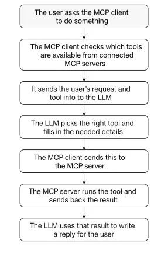
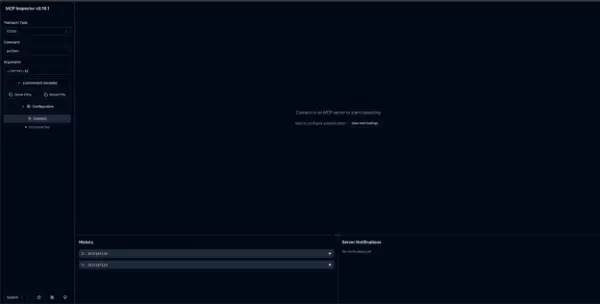
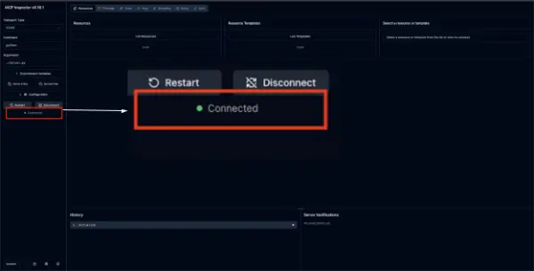
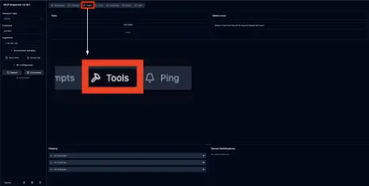
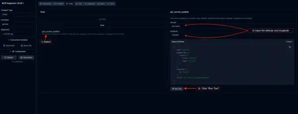
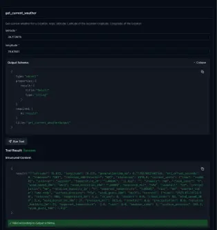
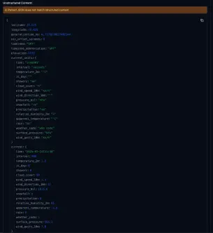

# MCP를 사용하여 간단한 에이전트형 AI 서버를 구축하는 방법

1. [MCP 소개](howto_build_simple_agentic_ai_with_mcp.md#1-mcp-소개)<br>
2. [에이전틱 AI 서버 구축 예제](howto_build_simple_agentic_ai_with_mcp.md#2-에이전틱-ai-서버-구축-예제)<br>
   2.1 [사전 준비](howto_build_simple_agentic_ai_with_mcp.md#21-사전-준비)<br>
   2.2 [파이썬 개발 환경 설정](howto_build_simple_agentic_ai_with_mcp.md#22-파이썬-개발-환경-설정)<br>
   2.3 [날씨 관련 MCP 서버 구축](howto_build_simple_agentic_ai_with_mcp.md#23-날씨-관련-mcp-서버-구축)<br>
   2.4 [MCP 서버 테스트](howto_build_simple_agentic_ai_with_mcp.md#24-mcp-서버-테스트)<br>
   2.5 [MCP 서버에 새로운 도구 추가하기](howto_build_simple_agentic_ai_with_mcp.md#25-mcp-서버에-새로운-도구-추가하기)<br>
3. [요약 및 참조](howto_build_simple_agentic_ai_with_mcp.md#3-요약-및-참조)<br>
<br>
<br>

## 1. MCP 소개

### 1.1 개요

인공지능 에이전트의 기능이 향상됨에 따라 개발자는 실제 데이터 및 도구에 연결하는 안정적인 방법을 필요로 합니다. 모델 컨텍스트 프로토콜(MCP)은 이러한 연결을 가능하게 하는 표준화된 접근 방식을 제공하여 인공지능 시스템을 더욱 유용하고 안전하며 확장 가능하게 만듭니다. 
<br>

### 1.2 Model Context Protocol (MCP)란

#### 1.2.1 모델 컨텍스트 프로토콜(MCP)

* MCP는 개발자가 데이터 소스와 AI 기반 애플리케이션 간에 안전하고 양방향적인 연결을 구축할 수 있도록 지원하는 개방형 표준
* MCP 서버는 대규모 언어 모델(LLM)이 자체 지식 기반을 넘어 인터넷, 데이터베이스, API 등과 상호 작용할 수 있도록 해주는 스마트 어댑터와 같음

#### 1.2.2 MCP와 LLM

* MCP는 LLM이 일반적인 응답을 넘어설 수 있도록 지원함으로써 LLM의 성능을 향상시킴
* MCP 표준을 사용하는 LLM은 이러한 기능을 제공하는 외부 MCP 서버와 통신하여 함수를 호출하고, 데이터를 가져오고, 작업을 수행할 수 있음
* MCP 표준이 제공하는 기능 예

  + **도구**: 모델이 호출할 수 있는 함수(예: `lookup_customer_by_email`)
  + **리소스**: 모델이 참조할 수 있는 구조화된 데이터(예: 제품 카탈로그, 사용자 기록)
  + **프롬프트 템플릿**: 시스템이 모델 동작을 안내하는 데 사용할 수 있는 미리 작성된 프롬프트(예: 이 고객의 감정 이력 요약)

#### 1.2.3 MCP 서버와 클라이언트 간 정보 교환


1. 클라이언트는 먼저 서버의 기능에 대한 정보를 요청
2. 그런 다음 클라이언트는 명령이나 질의를 전송
3. 버는 이러한 요청을 처리하여 적절하게 응답

> [!NOTE]
> 이를 통해 AI 에이전트와 외부 도구 간의 원활한 상호 작용이 가능해집니다.
<br>
<br>

## 2. 에이전틱 AI 서버 구축 예제

* [Open-Meteo API](https://open-meteo.com/en/docs)에 연결하여 실시간 날씨 데이터와 예보를 제공하는 MCP 서버 구축
* Open-Meteo API는 쿼리 매개변수를 사용하여 쉽게 구성할 수 있고 API 키가 필요하지 않으므로 언어 ​​모델과의 통합에 이상적

### 2.1 사전 준비

#### 2.1.1 VSCode 준비

* VSCode 설치 및 구성
* VSCode에 사용할 프로그래밍 언어 준비
  + 파이썬
  + Node.js/TypeScript
  + Java / Go
  + 기타 등등
* 파이썬 패키지 관리를 위한 `uv` 패키지

#### 2.1.2 `uv` 설치

MacOS 사용자
```bash
brew install uv
```

윈도우 사용자
```bash
winget install --id=astral-sh.uv  -e
```
<br>

### 2.2 파이썬 개발 환경 설정

#### 2.2.1 프로젝트를 위한 디렉터리 생성

```bash
mkdir mcp-server-weather
cd mcp-server-weather
```

#### 2.2.2 `uv` 프로젝트 초기화

```bash
uv init
```

#### 2.2.3 `uv` 가상환경 생성

```bash
uv venv
```

#### 2.2.4 가상 환경 활성화

```bash
source .venv/bin/activate
```

#### 2.2.5 MCP SDK 및 필요한 패키지 설치

```bash
uv add “mcp[cli]” httpx
```
* `mcp-cli` 패키지는 파이썬 3.10 이상 필요
<br>

### 2.3 날씨 관련 MCP 서버 구축

#### 2.3.1 Open-Weather API 소개

* `/forecast` 엔드포인트를 제공
  + 위도와 경도만 입력하면 해당 위치의 현재 날씨와 시간별 예보를 가져옴
  + 원하는 날씨 데이터의 종류와 양을 사용자 지정할 수 있는 선택적 매개변수를 추가하여 다양한 응용 프로그램에 유연하게 활용
  
#### 2.3.2 MCP 도구 설계

* 언어 모델이 API에서 데이터를 자동으로 요청하고 MCP 서버가 해당 데이터에 따라 작업을 수행할 수 있도록 하려면 각 API 상호 작용을 도구 형태로 노출
* 이 접근 방식을 통해 서버를 모듈화하고 LLM이 명확하고 구조화된 방식으로 특정 작업을 쉽게 실행

#### 2.3.3 파이썬 SDK를 통한 도구 구축

```python
@mcp.tool()
async def get_current_weather(latitude: float, longitude: float) -> str:
   """Get current weather for a location.
   Args:
       latitude: Latitude of the location
       longitude: Longitude of the location
   """
  
   url = f"{OPENMETEO_API_BASE}/forecast?latitude={latitude}&longitude={longitude}&current=temperature_2m,is_day,showers,cloud_cover,wind_speed_10m,wind_direction_10m,pressure_msl,snowfall,precipitation,relative_humidity_2m,apparent_temperature,rain,weather_code,surface_pressure,wind_gusts_10m"
  
   data = await make_openmeteo_request(url)
   if not data:
       return '{"error": "Unable to fetch current weather data for this location."}'
   return json.dumps(data)
```
* 위도와 경도를 제공하여 현재 날씨를 요청하는 도구
<br>

### 2.4 MCP 서버 테스트

#### 2.4.1 MCP 서버를 개발자 모드로 실행

실행 명령어
```bash
mcp dev server.py
```

실행 결과
```
Starting MCP inspector...
⚙️ Proxy server listening on localhost:6277
🔑 Session token: 95a1198f988fd782d244b404c2796ace3cc408489345bedae74cadd45c7c6002
   Use this token to authenticate requests or set DANGEROUSLY_OMIT_AUTH=true to disable auth
🚀 MCP Inspector is up and running at:
   http://localhost:6274/?MCP_PROXY_AUTH_TOKEN=95a1198f988fd782d244b404c2796ace3cc408489345bedae74cadd45c7c6002
```
* MCP Inspector가 로컬에서 실행 중
  + 브라우저에서 자동으로 연결됨
  + 아닌 경우에는 MCP Inspector가 실행 중인 URL을 클릭하여 브라우저에서 확인

#### 2.4.2 브라우저에서 MCP Inspector 대시보드 확인



#### 2.4.3 왼쪽 메뉴의 **Connect** 클릭


* 실행 중인 MCP 서버에 연결됨
* 연결되면 **Connected**가 표시됨

#### 2.4.4 상단의 메뉴에서 **Tool** 탭 클릭



#### 2.4.5 리스트에 표시된 *get_current_weather* 클릭


* 위도와 경도를 각각 입력 (미국 노스캐롤라이나주 롤리에 있는 레드햇 본사)
  + 위도: 35.773575
  + 경도: 78.67601

#### 2.4.6 실행을 위해 **Run Tool** 클릭


* **Tool Result** 하단에 JSON 형태의 결과 값 확인

#### 2.4.7 JSON 결과 값 확인


<br>

### 2.5 MCP 서버에 새로운 도구 추가하기

#### 2.5.1 첫 번째 MCP 서버 리뷰

* 첫 번째 MCP 서버에 Open-Meteo API를 사용하여 특정 위치의 현재 날씨를 가져오는 `get_current_weather`라는 도구 생성
* 하나의 도구부터 시작하면 MCP 서버를 설정하고 실행하는 기본 사항을 이해하는 데 도움이 됨
* 코드에서 MCP 서버를 구축할 때 `get_current_weather` 도구만 정의했기 때문에 여기서는 해당 도구만 볼 수 있음
* 같은 방식으로 MCP 서버 위에 더 많은 도구를 추가하여 MCP 서버의 도구를 확장할 수 있음 

#### 2.5.2 MCP 서버에 도구 추가 예

`get_location` 도구는 Open-Meteo 지오코딩 API를 사용하여 더 정확한 위치 검색을 수행
1. VS Code에서 프로젝트 오픈
   + 코드 편집기를 실행
   + MCP 서버 코드가 있는 프로젝트 폴더 오픈
2. 새 도구를 정의
   + server.py 파일(또는 MCP 서버가 포함된 파일)에서 각 새 도구를 함수로 정의
   + `@mcp.tool()` 데코레이터를 사용하여 MCP 도구로 등록
3. 도구 로직 구현
   + 각 함수 내부에 원하는 기능을 구현
   + `get_current_weather` 도구에 사용했던 것과 동일한 구조를 따름
4. MCP 인스펙터로 테스트
   + 새 도구를 정의했으면 MCP 인스펙터를 실행하여 테스트
   + 각 도구가 예상대로 작동하고 정확한 결과를 반환하는지 확인
<br>
<br>

## 3. 요약 및 참조

### 3.1 MCP와 Llama Stack, 그리고 vLLM

MCP의 기본적인 개념과 작동 방식을 간략하게 살펴보았습니다. 하지만 MCP의 진정한 힘은 Llama Stack과 같은 언어 모델 프레임워크와 연결될 때 발휘되며, Llama Stack은 vLLM과 같은 추론 제공자와 원활하게 연동됩니다.

Llama Stack은 도구 사용, 컨텍스트 및 검색을 관리하는 오케스트레이션 계층 역할을 하며, vLLM은 높은 처리량의 추론을 효율적으로 처리합니다. MCP 서버를 이 스택에 연결하면, 모델은 매번 사용자 지정 래퍼나 서버 로직을 작성할 필요 없이 날씨 정보 가져오기 예제와 같은 실제 도구를 필요에 따라 호출할 수 있게 됩니다. 이러한 모듈식 접근 방식을 통해 최소한의 상용구 코드로 높은 안정성을 갖춘 고급 도구 사용 AI 에이전트를 더욱 쉽게 구축할 수 있습니다.
<br>

### 3.2 참조

* [MCP Inspector](https://modelcontextprotocol.io/docs/tools/inspector)
* [Open-Meteo API](https://open-meteo.com/en/docs)
<br>
<br>

------
[차례](/README.md)