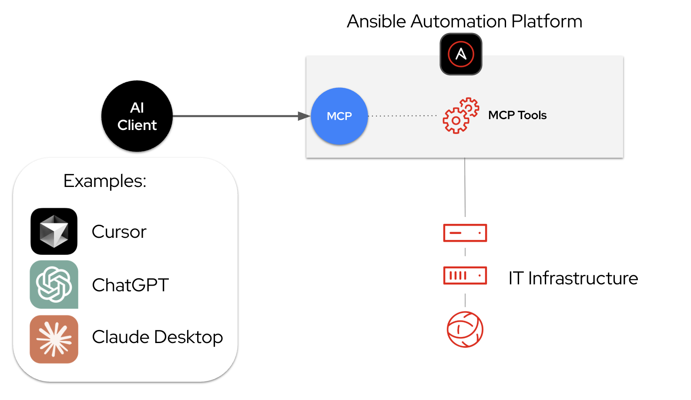

# AAP를 위한 MCP 서버 소개

1. [AAP용 MCP 서버](intro_mcp_server_for_aap.md#1-aap용-mcp) 
2. [작동 방식 및 중요성](intro_mcp_server_for_aap.md#2-작동-방식-및-중요성) 
3. [AAP용 MCP 서버 설치](intro_mcp_server_for_aap.md#3-aap용-mcp-서버-설치) 
4. [다음 단계](intro_mcp_server_for_aap.md#4-다음-단계) 

 
 

## 1. AAP용 MCP

### 1.2 TP로 제공된는 AAP용 MCP

레드햇 AAP의 인텔리전스 기능을 지속적으로 확장함에 따라, AAP 2.6.4에서 MCP 서버를 기술 미리 보기 기능으로 제공합니다.
* MCP 서버는 사용자가 선택한 MCP 클라이언트와 AAP 간의 브리지 역할 수행
* 이 통합을 통해 Cursor 및 Claude와 같은 새로운 도구를 사용하여 전체 인프라 환경을 효율적으로 관리
 

### 1.2 AAP용 MCP 서버란?

* LLM이 자연어 상호 작용을 통해 AAP와 상호 작용하고 관리할 수 있도록 하는 모델 컨텍스트 프로토콜(MCP) 서버 구현체
  + 자동화 운영의 복잡성을 줄임
  + 팀이 인프라 자동화를 활용하는 방식을 개선
  + 엔터프라이즈급 보안 및 거버넌스 유지

* AAP용 MCP 역할
  + 자동화 환경에 대한 대화형 인터페이스 제공
  + 기존 제어를 우회하지 않고 간단한 대화를 통해 기존 앤서블 자동화를 트리거하고 쿼리
 
 

## 2. 작동 방식 및 중요성

### 2.1 MCP 서버를 통한 사용자 제공 서비스

* 사용자가 선택한 AI 도구 및 LLM이 AAP와 직접 통신
* 사용자는 자동화 환경을 탐색하고, 쿼리하고, 이해
* 사용자는 자연어를 사용하여 자동화 워크플로우를 오케스트레이션
 

### 2.2 MCP 서버 배포

* MCP 서버는 AAP 내에 배포
  + 표준 AAP 설치 프로세스의 일부로 설치
  + 작업 관리, 인벤토리 관리, 보안 규정 준수와 같은 기능을 위한 포괄적인 도구 세트를 제공

* 배포 후 관리자는 MCP 서버를 두 가지 모드 중 하나로 구성
  + 안전한 쿼리 및 모니터링에 적합한 읽기 전용 모드
  + AI 에이전트가 작업을 실행하고 변경 사항을 적용할 수 있는 읽기/쓰기 모드
 

### 2.3 MCP 서버 보안

* 보안을 손상시키지 않고 AI 접근성을 확보하는 것이 중요
  + 이를 위해 작업, 콘텐츠, 모니터링 및 관리 기능에 대한 안전한 역할 기반 액세스를 제공
* MCP 서버는 서버 수준 및 사용자 수준 권한을 결합한 이중 계층 보안 모델 적용
  + AAP API에 직접 연결함으로써, MCP 서버는 역할 기반 접근 제어(RBAC) 및 거버넌스 정책을 통해 사용자 권한을 상속
  + 이러한 구조는 AI 에이전트가 서버 구성과 사용자가 정의한 권한에 따라 허용된 작업만 실행할 수 있도록 보장
 

### 2.4 자연어 인터페이스

* 사용자가 대화형 설명을 통해 작업을 실행할 수 있도록 하여 IT 자동화를 간소화
* 채팅 기반 접근 방식을 통해 자동화 생성이 더욱 간편해지므로 숙련된 엔지니어는 물론 초보 사용자도 쉽게 사용 가능

다음 데모는 제로 터치 배포부터 지능형 문제 해결에 이르기까지 5가지 실제 시나리오를 통해 이러한 이점을 보여줍니다. MCP 서버가 자연어 인터페이스를 통해 자동화 접근성을 높이면서도 엄격한 보안 및 거버넌스를 유지하는 방법을 시연합니다.
 
 

## 3. AAP용 MCP 서버 설치

### 3.1 설치 옵션

MCP 서버는 다음 두 가지 유형의 AAP 설치 환경에 배포

* RHEL 9 또는 10에 배포
  + 컨테이너화된 설치 프로그램을 통해 MCP 서버 배포
  + 서버는 AAP 구성 요소와 함께 Pod로 실행되며 HTTPS가 활성화된 8448 포트로 노출

* 레드햇 오픈시프트에 배포
  + AAP 운영자를 통해 MCP 서버를 배포
  + 운영자는 수명 주기 관리를 처리하고 필요한 오픈시프트 경로를 자동으로 생성
 

### 3.2 공식 문서

문서에는 설치 방법, 서버 및 사용자 수준 권한 구성 방법, 외부 AI 에이전트(예: Claude, Cursor, ChatGPT, VS Code) 연결 방법에 대한 지침이 포함

* RHEL에 설치하는 경우: [앤서블 MCP 서버 배포 - 컨테이너화된 설치](https://docs.redhat.com/ko/documentation/red_hat_ansible_automation_platform/2.6/html/containerized_installation/deploying-ansible-mcp-server)
* 레드햇 오픈시프트에 설치하는 경우: [앤서블 MCP 서버 배포 - 오픈시프트 컨테이너 플랫폼](https://docs.redhat.com/ko/documentation/red_hat_ansible_automation_platform/2.6/html/installing_on_openshift_container_platform/deploy-ansible-mcp-server-operator-install)
 

### 3.3 사용 가능한 도구 세트

MCP 서버는 현재 서로 다른 역할과 사용 사례를 지원하도록 설계된 6가지 특수 도구 세트 제공

|도구|설명|
|:---|:---|
|작업 관리|사용 가능한 작업 템플릿 목록을 확인하고, 자동화 작업을 실행하고, 실시간 상태를 모니터링하는 도구|
|인벤토리 관리|호스트 세부 정보, 그룹 멤버십, 시스템 정보를 확인하는 도구를 제공|
|시스템 모니터링|작업 로그를 검색하고, 실패한 작업을 해결하고, 자동화 환경의 상태를 확인하는 도구를 제공|
|사용자 관리|AI 에이전트가 AAP 내에서 액세스 권한 및 조직 구조를 관리할 수 있도록 지원하는 도구|
|보안 및 규정 준수|AI 에이전트가 보안 운영자 역할을 수행하여 민감한 자격 증명을 관리하고, 원시 비밀 정보를 노출하지 않고 플랫폼 무결성을 검증할 수 있도록 지원하는 도구|
|플랫폼 구성|관리자와 개발자가 AAP 인프라 자체를 검사하고 조정할 수 있도록 지원하는 도구|
 
 

## 4. 다음 단계

레드햇 AAP용 MCP 서버는 AI 통합을 통해 기업 자동화를 더욱 쉽고 강력하게 만드는 레드햇의 지속적인 전략에 있어 핵심적인 역할을 합니다.

보안에 중점을 둔 강력한 AAP 기능과 자연스럽고 대화형인 에이전트 AI를 통합함으로써 IT 협업, 자동화 및 혁신을 위한 새로운 가능성을 열어가고 있습니다.
 
 

------
[차례](/README.md)