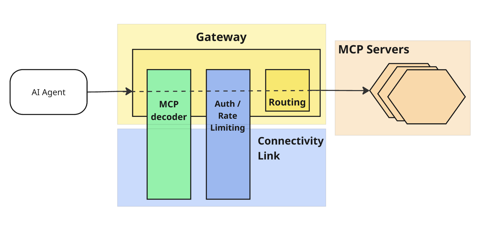

# 오픈시프트를 위한 MCP 게이트웨이

1. [Model Context Protocol](mcp_gateway_for_openshift.md#1-model-context-protocol)<br>
2. [MCP 게이트웨이](mcp_gateway_for_openshift.md#2-mcp-게이트웨이)<br>
   2.1 [MCP 게이트웨이 역할](mcp_gateway_for_openshift.md#21-mcp-게이트웨이의-역할)<br>
   2.2 [MCP 게이트웨이 주요 기능](mcp_gateway_for_openshift.md#22-mcp-게이트웨이의-주요-기능)<br>
   2.3 [MCP 게이트웨이 구성](mcp_gateway_for_openshift.md#23-mcp-게이트웨이-구성)<br>
3. [레드햇 Connectivity Link](mcp_gateway_for_openshift.md#3-레드햇-connectivity-link)<br>
   3.1 [MCP 게이트웨이와 API 게이트웨이](mcp_gateway_for_openshift.md#31-mcp-게이트웨이와-api-게이트웨이)<br>
   3.2 [MCP 트래픽 흐름](mcp_gateway_for_openshift.md#32-mcp-트래픽-흐름)<br>
   3.3 [MCP 게이트웨이 연동](mcp_gateway_for_openshift.md#33-mcp-게이트웨이-연동)<br>
99. [참조](mcp_gateway_for_openshift.md#99-참조)<br>
<br>
<br>

## 1. Model Context Protocol

### 1.1 MCP 연혁

* 2024년 말 Anthropic Games의 오픈 소스 프로젝트로 시작
* 현재 Linux Foundation 산하의 Agentic AI Foundation(이하 AAIF)에서 관리하며 140개 이상의 회원사를 보유
  + 레드햇은 AAIF의 골드 멤버
<br>

### 1.2 엔터프라이즈 환경에서 MCP

#### 1.2.1 MCP 도입을 위한 과제

* MCP 서버는 AI 에이전트에게 다양한 도구와 데이터에 대한 접근 권한을 제공
* 거버넌스 계층이 없다면 다음 항목들에 대하여 관되게 제어할 수 없음
  + 누가 무엇에 접근할 수 있는지
  + 접근 속도 제한은 어떻게 적용할지
  + 보안 정책은 어떻게 관리할지
  + 기타 등등

#### 1.2.2 MCP 게이트웨이

* 다양한 역할 중에 하나가 접근 권한에 관한 거버넌스 역할
* 레드햇은 Connectivity Link 기술을 통해 MCP 게이트웨이를 제공
<br>
<br>

## 2. MCP 게이트웨이

### 2.1 MCP 게이트웨이의 역할

* MCP 게이트웨이는 AI 에이전트와 에이전트가 연결하는 MCP 서버 사이에 위치
* 인프라 계층에서 트래픽 제어를 처리
  + 이 때문에, AI 플랫폼 팀은 AI 라이프사이클에 집중할 수 있음
* 여러 MCP 서버를 하나의 게이트웨이 엔드포인트로 통합하는 관리형 진입점을 제공
  + 에이전트는 모든 서버에서 사용 가능한 도구를 통합된 보기로 이용할 수 있음
  + 플랫폼 팀은 필요한 제어 권한을 확보할 수 있음
<br>

### 2.2 MCP 게이트웨이의 주요 기능
  
* MCP 서버 연합
  + 여러 MCP 서버의 도구를 단일 엔드포인트에 통합
  + 에이전트가 모든 서버에 대한 정보를 알 필요 없이 도구를 더 쉽게 검색하고 호출 가능
* 인증 및 권한 부여
  + Connectivity Link에서 이미 사용하고 있는 것과 동일한 메커니즘을 사용하여 MCP 서버 및 도구에 대한 액세스를 제어
* 수평 확장
  + Redis 기반 세션 저장소를 사용하여 다중 복제본 배포를 지원
  + 이를 통해 게이트웨이가 워크로드와 함께 확장 가능
* 가상 서버
  + 도구 목록을 더 작고 집중적인 그룹으로 나누어 위임 및 토큰 효율성을 높임
<br>

### 2.3 MCP 게이트웨이 구성

#### 2.3.1 기존 API 게이트웨이 확장을 위해 리소스 `MCPGatewayExtension` 생성

```yaml
apiVersion: mcp.kuadrant.io/v1alpha1
kind: MCPGatewayExtension
metadata:
  # Extend an existing gateway with MCP capabilities
  name: mcp-extension
  namespace: gateway-system
spec:
  # Points to your existing Gateway API gateway resource
  targetRef:
    group: gateway.networking.k8s.io
    kind: Gateway
    name: mcp-gateway
    namespace: gateway-system
```
* *spec.targetRef*는 기존의 API 게이트웨이를 가리키고 있음
* 리소스가 생성되면, 게이트웨이는 MCP 트래픽을 구분하도록 구성됨

#### 2.3.2 MCP 서버 등록을 위해 리소스 `MCPServerRegistration` 생성

```yaml
apiVersion: mcp.kuadrant.io/v1alpha1
kind: MCPServerRegistration
metadata:
  # Register a GitHub MCP server behind the gateway
  name: github-mcp
  namespace: mcp-servers
spec:
  # Prefix added to all tools from this server (e.g. github_search_repos)
  toolPrefix: "github_"
  # Points to the HTTPRoute that defines how traffic reaches this MCP server
  targetRef:
    group: "gateway.networking.k8s.io"
    kind: "HTTPRoute"
    name: "github-mcp-route"
    namespace: "mcp-servers"
```
* *spec.targetRef*는 MCP 서버 앞단의 `HTTPRoute`를 가리킴
* 선택적으로, 다른 서버의 도구 이름과 충돌하는 경우, 이 MCP 서버에서 검색된 모든 도구에 접두사를 구성할 수 있음

#### 2.3.3 MCP 서버 보안을 위해 리소스 `AuthPolicy` 생성

```yaml
apiVersion: kuadrant.io/v1
kind: AuthPolicy
metadata:
  name: mcp-auth
  namespace: gateway-system
spec:
  # Attaches to the gateway's MCP listener
  targetRef:
    group: gateway.networking.k8s.io
    kind: Gateway
    name: mcp-gateway
    sectionName: mcp
  defaults:
    # Skip auth for OAuth discovery endpoints
    when:
      - predicate: "!request.path.contains('/.well-known')"
    rules:
      authentication:
        # Validate JWTs issued by the Keycloak MCP realm
        "keycloak":
          jwt:
            issuerUrl: http://keycloak.example.com/realms/mcp
      response:
        # Return OAuth-compliant 401 with resource metadata for auto-discovery
        unauthenticated:
          code: 401
          headers:
            "WWW-Authenticate":
              value: Bearer
resource_metadata=http://mcp.example.com/.well-known/oauth-protected-resource/mcp
          body:
            value: |
              {
                "error": "Unauthorized",
                "message": "Authentication required."
              }
```
* *spec.targetRef*는 MCP 게이트웨이를 가리킴
* *spec.defaults*를 보면, Keycloak 인스턴스에 발급한 OAuth JWT 유효성 검사를 추가함
<br>
<br>

## 3. 레드햇 Connectivity Link 

### 3.1 MCP 게이트웨이와 API 게이트웨이

* Kubernetes 네이티브 표준인 게이트웨이 API를 기반으로 구축
  + 이를 통해 트래픽 관리 및 접근 제어를 지원
  + 이는 Connectivity Link의 나머지 구성 요소와 동일한 표준 기반 접근 방식
* **Policy** 연결
  + 게이트웨이 API 패턴으로, 트래픽에 인증, 속도 제한 및 기타 정책을 적용
  + 이는 MCP에서도 HTTP 및 gRPC(Google Remote Procedure Call) API와 동일한 방식으로 작동
  + 별도의 시스템을 학습할 필요가 없음
<br>

### 3.2 MCP 트래픽 흐름


1. AI 에이전트에서 게이트웨이를 거쳐 디코딩
2. 인증 및 속도 제한이 적용된 후 MCP 서버로 라우팅
<br>

### 3.3 MCP 게이트웨이 연동

#### 3.3.1 Connectivity Link

* API 관리 및 트래픽 정책에 Connectivity Link를 사용하고 있다면
  + MCP 게이트웨이는 동일한 거버넌스 모델을 AI 에이전트 트래픽에도 확장 적용

#### 3.3.2 오픈시프트 AI에 MCP 게이트웨이 구성

* 더욱 강력한 엔터프라이즈 AgentOps 및 거버넌스를 지원하도록 기능이 확장
* AI 허브의 MCP 카탈로그
  + 검증된 자산을 배포할 수 있는 중앙 집중식 관리 공간을 제공
* 에이전트가 승인된 도구에만 액세스할 수 있도록 하는 ID 기반 도구 필터링 및 민감한 통화에 대한 필수 승인과 같은 고급 보안 기능을 추가
* MLflow 통합을 통해 모든 대규모 언어 모델(LLM) 호출 및 도구 실행을 기록하여 포괄적인 관찰 가능성을 제공하고 엔드 투 엔드 에이전트 추적 기능을 제공
* Connectivity Link와 결합하면 자율 워크플로는 엔터프라이즈 보안 정책을 준수하면서 완벽하게 관찰 및 감사가 가능
<br>
<br>

## 99. 참조

* MCP 게이트웨이가 기반으로 하는 [Kuadrant MCP 게이트웨이](https://github.com/Kuadrant/mcp-gateway)
* 엔터프라이즈 환경을 위한 [게이트웨이 패턴 아키텍처](https://www.infoq.com/news/2026/04/aaif-mcp-summit/)
<br>
<br>

<hr>

------
[차례](/README.md)
