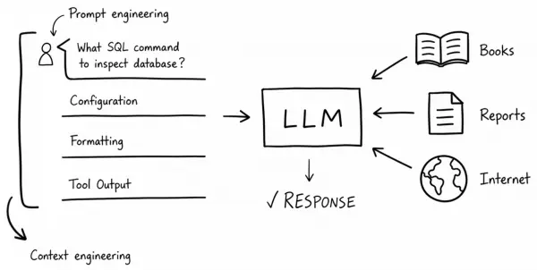
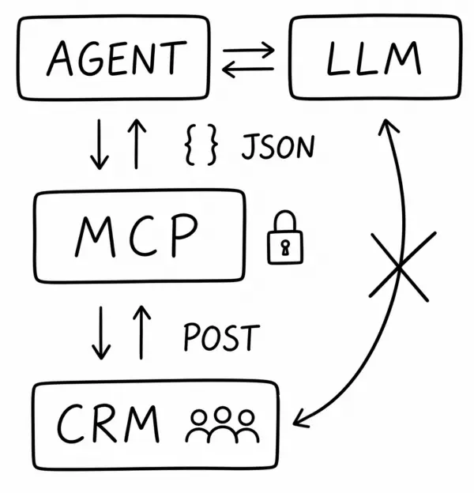
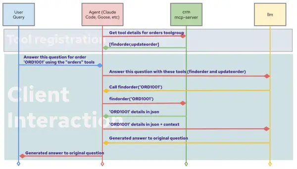
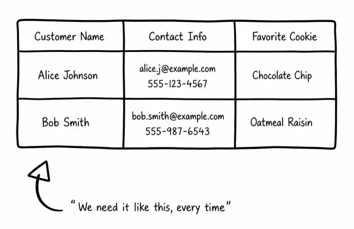
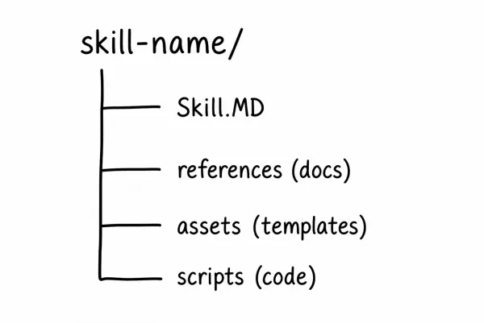

# MCP 서버와 에이전트를 위한 스킬

1. [컨텍스트 엔진니어링](mcp_server_and_agent_skill.md#1-컨텍스트-엔진니어링)<br>
2. [MCP를 사용하여 외부 데이터 연결](mcp_server_and_agent_skill.md#2-mcp를-사용하여-외부-데이터-연결)<br>
3. [전문 지식과 스킬을 결합](mcp_server_and_agent_skill.md#3-전문-지식과-기술skill을-결합)<br>
4. [MCP 서버 vs. 스킬](mcp_server_and_agent_skill.md#4-mcp-서버-vs-스킬)<br>
5. [요약 및 참조](mcp_server_and_agent_skill.md#5-요약-및-참조)<br>
<br>
<br>

## 1. 컨텍스트 엔진니어링

### 1.1 적절한 컨텍스트를 위한 MCP 서버와 스킬

대규모 언어 모델 (LLM)은 효율적인 범용 도구이지만, 적절한 컨텍스트를 제공하면 훨씬 더 잘 작동합니다. 코딩 도우미를 사용하든, 에이전트 기반 애플리케이션을 구축하든, 선호하는 모델에서 더 정확한 답변을 얻으려고 하든, LLM의 기능을 확장하는 두 가지 주요 방법은 모델 컨텍스트 프로토콜(MCP) 서버와 스킬입니다.

두 방법 모두 모델의 컨텍스트 창을 확장하지만, 근본적으로 다른 문제를 해결합니다.
<br>

### 1.2 수동 구문 분석에서 자동화된 컨텍스트 파이프라인으로 워크플로 전환

#### 1.2.1 LLM이 컨텍스트가 필요한 이유

LLM(로컬 라이프 모델)은 대규모 데이터셋으로 학습된 예측 엔진으로, 레드햇의 이력을 파악하거나, 데이터베이스 스키마를 검사하는 SQL 명령어를 결정하거나, Dockerfile을 작성할 수 있습니다. 대부분의 모델은 이러한 일반적인 질문에 답하는 데 탁월합니다. 그러나 특정 사용 사례에 맞는 정확한 답을 얻으려면 적절한 컨텍스트를 제공해야 합니다.

#### 1.2.2 수동 구문 분석

예를 들어, 팀의 데이터베이스 작업에 대한 도움을 모델에 요청한다고 가정해 보겠습니다.
* 질문 외에도 모델은 관련 컨텍스트가 필요
  + 여기에는 팀에서 개발 또는 프로덕션 환경에 사용하는 구성, 전송할 쿼리 형식, 사용 가능한 테이블을 확인하는 데 실행된 도구 등이 포함
* 과거에는 이러한 정보를 제공하는 것이 전적으로 수동 작업
  + 즉, 문서를 복사하여 붙여넣고, 길고 자세한 프롬프트를 작성한 다음, 모델이 질문을 이해하고 모든 것을 정확하게 조합하기를 바라는 방식
  
#### 1.2.3 자동화된 컨텍스트 파이프라인


* 수동 구문 분석에서 자동화된 컨텍스트 파이프라인으로의 워크플로 전환
* [켄텍스트 엔진니어링](https://www.anthropic.com/engineering/effective-context-engineering-for-ai-agents)
  + 단순히 지침, 페르소나, 기본 가이드라인만 제공하는 프롬프트 엔지니어링을 넘어섬
  + 모델이 정확하고 유용한 답변을 제공하는 데 필요한 모든 것을 갖추도록 적절한 데이터, 도구, 지침을 선별
<br>
<br>

## 2. MCP를 사용하여 외부 데이터 연결

상담원이 필요로 하는 컨텍스트가 외부 서비스(예: 고객 관계 관리(CRM) 솔루션, 데이터베이스 또는 클라우드 제공업체의 API)에 있다고 가정해 보겠습니다. 이전에는 AI 상담원을 사용할 때 서비스의 API 문서를 인증 토큰이 포함된 사용자 지정 도구로 수동으로 변환하고, LLM(로컬 라이프사이클 관리자)에게 고객 연락처 정보를 업데이트하도록 지시한 다음, 제대로 작동하기를 바랄 수밖에 없었습니다.

### 2.1 모델 컨텍스트 프로토콜 (MCP)

#### 2.1.1 MCP와 에이전트


* MCP는 AI 에이전트가 외부 데이터 소스와 통신하는 방식을 표준화
  + MCP가 에이전트와 외부 서비스 간의 브리지 역할을 수행
  + 이를 통해 LLM은 API와 직접 상호 작용하지 않고도 JSON 데이터를 안전하게 교환
* 각 도구마다 맞춤형 통합을 구현하는 대신, MCP는 다음과 같은 기능을 제공하는 범용 인터페이스를 제공
  + 서비스 API를 간단하고 LLM에서 바로 사용할 수 있는 형식 으로 추상화
  + AI 모델에 특정 권한(예: 읽기 또는 쓰기)이 있는 범위 지정 액세스 토큰을 발급하여 인증을 관리
  + LLM에게 MCP 서버와 상호 작용하기 위한 특정 JSON을 제공하도록 지시
    - 예: GET레코드를 가져오거나 POST업데이트를 제출하는 데 사용
  + LLM이 MCP 서버의 도구를 호출하기 위해 생성해야 하는 구조화된 JSON 입력을 정의

#### 2.1.2 MCP를 통한 컨텍스트 플로우


1. 내부적으로 IDE 또는 AI 애플리케이션에 MCP 서버를 추가
2. 에이전트 클라이언트가 사용 가능한 도구를 검색
3. 모델의 컨텍스트에 설명을 추가하여 활성 Kubernetes 리소스를 볼 수 있음을 알림
4. 사용자가 요청을 보내면 모델은 대화와 함께 이러한 도구 설명을 보고 어떤 도구를 어떤 인수로 호출할지 결정

> [!NOTE]
> 이 순서도를 보면, 에이전트가 CRM MCP 서버에서 사용 가능한 도구를 등록하고, LLM을 통해 쿼리를 라우팅하고, 근거 있는 답변을 반환하는 전체 MCP 상호 작용 수명 주기를 보여줍니다.
<br>

### 2.2 MCP 서버 상호작용의 간소화된 예

* AI 에이전트가 고객 정보를 조회하도록 구성된 CRM MCP 서버를 가지고 있고, 사용자가 customer_123의 연락처 정보를 요청했다고 가정
* 그러면 LLM은 다음과 같은 JSON을 생성
  ```json
  {
    "tool": "crm_get_contact",
    "parameters": {
      "customer_id": "cust_12345"
    }
  }
  ```
* LLM은 실제 API 호출, 인증 및 응답 형식 지정을 처리하는 MCP 서버와 분리됨
  + LLM은 추론 가능한 구조화된 데이터를 반환 받음
<br>
<br>

## 3. 전문 지식과 기술(skill)을 결합

### 3.1 도메인 전문 지식에 대한 MCP의 과제 

#### 3.1.1 MCP의 도전과제 및 스킬의 필요성

* MCP는 "LLM에 외부 데이터를 어떻게 제공할 것인가"라는 문제를 해결했지만, 또 다른 과제가 남아 있음
  + 바로 LLM이 아직 보유하지 못했을 수도 있는 도메인 전문 지식을 어떻게 제공할 것인가?
* 예) MCP를 사용하면 CRM에서 고객 기록을 가져올 수 있지만, 영업팀은 출력 형식이 매번 정확히 동일하기를 원함
  
  + 즉, 고객 이름, 연락처 정보, 그리고 고객이 가장 좋아하는 쿠키 맛이 포함되기를 원함
  + 명확한 지침이 없으면 모델은 매번 다른 형식으로 출력

#### 3.1.2 LLM의 박복 작업을 스킬로 패키징

* LLM을 반복적으로 사용할 수 있는 작업 예
  + 특정 형식으로 엑셀 문서를 정리하기
  + 코드 디버깅 (예: maven verify수정 사항을 제안하기 전에 항상 실행)
  + 표준 템플릿에 대한 규정 준수 검사 실행
  + 팀의 스타일 가이드에 따라 보고서 형식을 지정

* [스킬](https://agentskills.io/)
  + LLM(학습 모듈)에게 특정 작업을 수행하는 방법을 가르치는 재사용 가능하고 구조화된 지침
  + LLM의 반복적인 작업을 다음과 같은 세 부분으로 구성된 스킬로 패키징
    - **제목**: 당신과 모델이 역량을 식별하는 방법
    - **설명**: 해당 스킬을 모델의 컨텍스트에 추가해야 하는 시점
    - **주제**: 지침, 예시, 템플릿 및 스크립트   

#### 3.1.3 스킬의 [자동 로딩](https://agentskills.io/skill-creation/best-practices) 핵심 기능

기본 에이전트는 필요할 때만 관련 스킬을 컨텍스트 창에 로드
* 코드 디버거 스킬은 코드 오류에 대해 문의할 때만 활성화되고, 문서 서식 지정 스킬은 문서를 작업할 때만 로드됨
* 이를 통해 컨텍스트 창의 효율성을 유지하면서 필요에 따라 전문적인 지식을 제공
* LLM 비용이 상승하는 상황 에서 이러한 기능은 리소스 지출을 효율적으로 관리하는 데 도움

#### 3.1.4 스킬, AI 도구 전반에 걸쳐 널리 채택되는 패턴

* Claude Code와 같은 코딩 도우미를 통해 대중화된 [skill.md](https://agentskills.io/specification) 형식은 여러 플랫폼에서 사실상의 표준으로 자리 잡음
* 프런트엔드 디자인부터 쿠버네티스 배포 및 데이터 분석에 이르기까지 모든 것을 다루는 수천 개의 항목이 포함된 [커뮤니티에서 관리되는 스킬 라이브러리](https://github.com/anthropics/skills)를 찾아볼 수 있음
<br>

### 3.2 스킬 사양 및 구성 요소

#### 3.2.1 스킬 문서 정의

[클로드 코드의 skill.md 문서](https://code.claude.com/docs/en/skills)
```md
---
name: explain-code
description: Explains code with visual diagrams and analogies. Use when explaining how code works, teaching about a codebase, or when the user asks "how does this work?"
---
When explaining code, always include:
1. **Start with an analogy**: Compare the code to something from everyday life
2. **Draw a diagram**: Use ASCII art to show the flow, structure, or relationships
3. **Walk through the code**: Explain step-by-step what happens
4. **Highlight a gotcha**: What's a common mistake or misconception?
Keep explanations conversational. For complex concepts, use multiple analogies.
```

#### 3.2.2 패키지된 스킬의 표준 디렉터리 구조

* skill.md 파일 로드
  + AI 코딩 도우미 또는 AI 에이전트에 skill.md 추가
  + "개발 환경에서 데이터베이스 쿼리를 어떻게 처리하고 있나요?"라고 질문할 때 해당 스킬이 자동으로 로드
  + 모델은 이러한 표준화된 규칙을 자동으로 따름

* 패키지된 스킬의 표준 디렉터리 구조

  + 마크다운 파일 외에도 컨텍스트를 제공하기 위해 *references*, *assets*, 또는 *scripts* 와 같은 선택적 폴더를 포함할 수 있음
<br>
<br>

## 4. MCP 서버 vs. 스킬

### 4.1 MCP 서버는 언제 사용해야 할까요?

* AI 애플리케이션이 엄격한 권한 관리 하에 실시간 외부 데이터에 접근해야 할 때 MCP를 사용
  + MCP는 에이전트와 도구를 통합하는 계층
  + MCP를 사용하면 현재 실행 중인 가상 머신을 조회하거나, 클라우드 공급자의 클러스터 상태를 확인하거나, 고객 연락처 정보를 요청할 수 있음

* MCP는 모델이 데이터를 처리하는 방식이 아니라 데이터 자체에서 가치가 나올 때 적합한 선택
  + 모델은 외부 시스템 에서 읽 거나 써야 하는데 , MCP는 이를 위한 보안에 초점을 맞춘 표준화된 파이프라인을 제공
<br>

### 4.2 스킬을 언제 사용해야 할까요?

* AI에 재사용 가능한 사용자 지정 기능만 추가하면 되는 경우라면 MCP 서버를 설정하고 구성하는 것은 과도할 수 있음
  + 바로 이런 부분에서 스킬이 빛을 발함

* 스킬은 간단한 기능으로, 모델에게 특정 작업을 수행하는 방법을 알려줌
* 스킬 사용 예
  + 스킬에 포함된 스크립트나 예제를 사용하여 투자 데이터를 가져오고 분석하는 방법을 알려줄 수 있음
  + 여러 대화에서 동일한 프롬프트를 반복해하는 경우
  + 팀 전체에서 일관된 출력 형식이 필요한 경우
  + 모델에 도메인별 모범 사례를 제공하려는 경우
<br>

### 4.3 MCP와 스킬을 결합하여 포괄적인 워크플로우 구현

* MCP와 스킬은 경쟁하는 접근 방식이 아니라 상호 보완적인 관계
  + 가장 효과적인 AI 에이전트는 이 두 가지를 모두 활용
  
* 예) DevOps 팀을 위한 AI 에이전트를 구축하는 시나리오
  + MCP는 에이전트를 쿠버네티스 클러스터, 모니터링 스택 및 장애 관리 시스템에 연결
    - 에이전트는 Pod 상태를 조회하고, 메트릭을 가져오고, 장애 티켓을 생성
  + 스킬은 상담원에게 팀의 사고 대응 운영 매뉴얼을 가르침
    -  즉, 경고를 분류하는 방법, 중요한 임계값, 사고 후 보고서 형식을 지정하는 방법, 그리고 어떤 Slack 채널에 알림을 보내야 하는지 등을 알려줌
* 상호 보완
  + MCP가 없으면 상담원은 시스템에 접근할 수 없음
  + 스킬이 없으면 상담원은 시스템에 접근할 수는 있지만 프로세스를 알지 못함
  + MCP와 스킬을 함께 사용하면 상담원은 활성 상태를 모니터링하고 팀의 프로세스에 따라 대응 가능
<br>
<br>

## 5. 요약 및 참조

### 5.1 요약

* MCP와 스킬은 모두 AI 환경 전반에서 널리 사용되는 오픈 소스 기능
* 대부분의 공급업체는 공식 MCP 서버 , 특정 스킬 또는 둘 다를 제공
* 이러한 기능을 AI 코딩 도우미 또는 에이전트로 직접 가져올 수 있음
  + 기본 코드를 검토하고 샌드박스 환경에서 이러한 요소를 실행하여 동작을 안전하게 검증하
<br>

### 5.2 참조

* 앤트로틱의 [켄텍스트 엔진니어링](https://www.anthropic.com/engineering/effective-context-engineering-for-ai-agents)
* 앤트로픽의 모델 컨텍스트 프로토콜 ([MCP: Model Context Protocol](https://www.anthropic.com/news/model-context-protocol))
  + [MCP 서버 개념](https://modelcontextprotocol.io/docs/learn/server-concepts)
  + [MCP 인증](https://modelcontextprotocol.io/docs/tutorials/security/authorization)
* [스킬](https://agentskills.io/)
  + 스킬의 [자동 로딩](https://agentskills.io/skill-creation/best-practices)
  + [skill.md](https://agentskills.io/specification) 사양
  + 앤트로픽의 [스킬 라이브러리](https://github.com/anthropics/skills)
  + [클로드 코드의 skill.md 문서](https://code.claude.com/docs/en/skills)
<br>
<br>

------
[차례](/README.md)