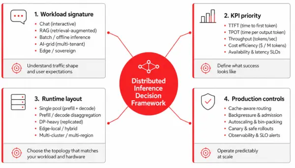
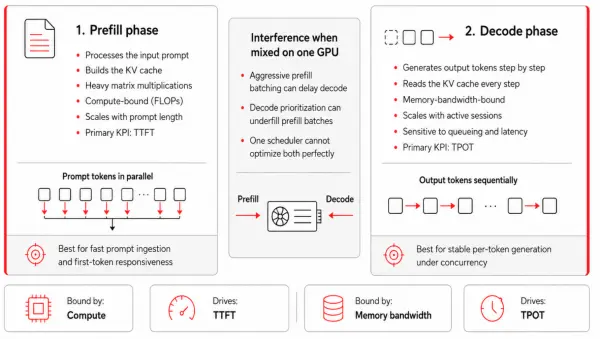
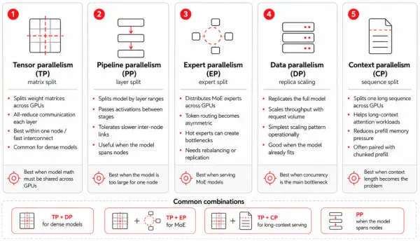

# 분산형 AI 추론 설계: 핵심 개념 및 확장성 고려 사항

**목차**
1. [Prefill, Decode, 그리고 5D 병령 처리](design_distributed_ai_Inference.md#1-prefill-decode-그리고-5d-병령-처리) 
   1.1 [서두](design_distributed_ai_Inference.md#11-서두) 
   1.2 [서비스 청사진](design_distributed_ai_Inference.md#12-서비스-청사진) 
   1.3 [비즈니스 요구 사항 매핑](design_distributed_ai_Inference.md#13-비즈니스-요구-사항-매핑) 
   1.4 [AI 추론 생태계 변화](design_distributed_ai_Inference.md#14-ai-추론-생태계-변화) 
2. [사전 채우기/디코딩: 두 단계, 두 가지 KPI](design_distributed_ai_Inference.md#2-사전-채우기디코딩-두-단계-두-가지-kpi) 
   2.1 [Prefill/Decode](design_distributed_ai_Inference.md#21-prefilldecode) 
   2.2 [사전 채우기/디코딩의 대조적인 특성과 리소스 병목 현상](design_distributed_ai_Inference.md#22-사전-채우기디코딩의-대조적인-특성과-리소스-병목-현상) 
3. [5차원 병렬성](design_distributed_ai_Inference.md#3-5차원-병렬성) 
   3.1 [텐서 병렬 처리](design_distributed_ai_Inference.md#31-텐서-병렬-처리-tp-tensor-parallelism) 
   3.2 [파이프라인 병렬 처리](design_distributed_ai_Inference.md#32-파이프라인-병렬-처리-pp-pipeline-parallelism) 
   3.3 [전문가 별령 처리](design_distributed_ai_Inference.md#33-전문가-별령-처리-ep-expert-parallelism) 
   3.4 [데이터 병렬 처리](design_distributed_ai_Inference.md#34-데이터-병렬-처리-dp-data-parallelism) 
   3.5 [컨텍스트 병렬 처리](design_distributed_ai_Inference.md#35-컨텍스트-병렬-처리-cp-context-parallelism) 
   3.6 [사전 채우기/디코딩 성능과 하드웨어 병렬 처리 옵션](design_distributed_ai_Inference.md#36-사전-채우기디코딩-성능과-하드웨어-병렬-처리-옵션) 
 
 

## 1. Prefill, Decode, 그리고 5D 병령 처리

### 1.1 서두

vLLM과 같은 모델 서빙 엔진을 선택하는 것은 기업 AI 추론을 위한 중요한 첫걸음이지만, 이는 단지 기초일 뿐입니다. 런타임 자체만으로는 서비스의 확장성, 운영 방식, 그리고 프로덕션 환경에서의 비용 대비 성능 균형을 결정할 수 없습니다.

이 블로그에서는 추론의 핵심 용어를 정립하고, 토큰 생성 단계(사전 채우기 vs. 디코딩) 간의 구조적 긴장 관계를 분석하며, 인프라의 기본 한계를 제어하는 ​​데 필요한 병렬 처리 수준을 설명할 것 입니다.
 

### 1.2 서비스 청사진

* 모델의 요구 사항, 하드웨어 예산, 서비스 수준 목표를 실제 워크로드에 맞는 배포 매니페스트에 매핑하여 서비스 청사진을 설계
* 워크로드는 비즈니스 요구 사항에 따라 달라지기 때문에 모든 경우에 맞는 단일 청사진은 없음
* 요구 사항 예
  + 동시에 몇 개의 요청이 도착합니까?
  + 프롬프트와 컨텍스트가 실행되는 시간은?
  + 주제 영역
  + 각 요청에 필요한 추론의 양은?
 

### 1.3 비즈니스 요구 사항 매핑

* 다음과 같은 몇 가지 주요 KPI에 비즈니스 요구 사항을 매핑
  + 최초 토큰 생성 시간(TTFT)
  + 출력 토큰당 시간(TPOT, 또는 토큰 간 지연 시간)
  + 초당 요청 수 및 초당 토큰 처리량
  + GPU 활용률
  +  키-값(KV) 캐시 적중률

* KPI들은 서로 끊임없이 상충 관계에 있으므로 다음과 같은 문제를 고려
  
  + 대부분의 배포 결정은 어떤 워크로드에 대해 어떤 상충 관계를 감수할 수 있는지
  + 어떤 비즈니스 이점을 얻을 수 있는지
 

### 1.4 AI 추론 생태계 변화

* llm-d 프로젝트가 CNCF 샌드박스에 승인
  + 보다 명확한 개방형 거버넌스 경로를 확보
  + 벤더 중립성, 커뮤니티 관리 및 장기적인 생태계 조화가 중요한 환경에서 평가하기가 더 쉬워짐

* 키-값(KV) 캐시 관리는 분산 추론 분야에서 가장 활발한 혁신 영역 중 하나가 됨
  + NIXL, LMCache, Mooncake와 같은 프로젝트들은 KV 캐시 전송, 재사용 및 오프로드에 대한 다양한 접근 방식을 중심으로 경쟁하고 있으며, 그 결과는 서로 수렴
  + 플랫폼 팀에게 있어 이는 캐시 아키텍처가 이제 최우선 설계 결정 사항이 되었음을 의미
  + 캐시 아키텍처는 지연 시간, 네트워크 요구 사항, 장애 처리, 관찰 가능성, 하드웨어 선호도, 그리고 프리필 및 디코딩 풀의 크기 조정에 영향을 미치기 때문

* 추측 디코딩은 연구 기법에서 실용적인 최적화 경로로 나아가고 있음
  + EAGLE 팀, vLLM 팀, 그리고 TorchSpec의 협력으로 개발된 EAGLE 3.1은 2026년 5월 말에 출시
    - EAGLE-3보다 장기 컨텍스트 수용 길이가 크게 향상
  + 이로써 추측 디코딩은 이전에는 적용이 어려웠던 장문 문서 워크로드에서 더욱 유용해졌지만, 핵심적인 엔지니어링 질문은 여전히 ​​남아 있음
    - 수용률, 메모리 오버헤드, 배치 처리 동작, 그리고 운영 복잡성을 고려하여 특정 배포 환경에서 추측 디코딩을 활성화하는 것이 타당한지 여부에 대한 질문
 
 

## 2. 사전 채우기/디코딩: 두 단계, 두 가지 KPI

### 2.1 Prefill/Decode

LLM 추론은 두 개의 작업 부하가 하나인 척하는 것입니다.

#### 2.1.1 사전 채우기 (Prefill)

* 입력 프롬프트를 처리하고 키-값 캐시를 채움
* 프롬프트 토큰은 병렬로 처리 가능
  + 이 단계는 밀집 행렬 연산이 주를 이루며 계산 집약적인 경향
  + 특히 긴 프롬프트나 검색 증강 생성 워크로드의 경우, 이 단계가 첫 번째 토큰 표시 시간(TTFT)의 주요 원인

#### 2.1.2 디코딩 (Decode)

* 응답 토큰을 하나씩 생성하며, 새로운 토큰이 생성될 때마다 누적된 KV 캐시를 반복적으로 처리
* 이 단계는 메모리 대역폭에 제약을 받는 경향이 있음
  + 순수 연산 능력보다는 HBM 용량과 대역폭에 더 큰 부담을 줌
  + 또한, 이 단계는 출력 토큰당 소요 시간(TPOT), 즉 토큰 간 지연 시간의 주요 원인

### 2.2 사전 채우기/디코딩의 대조적인 특성과 리소스 병목 현상

#### 2.2.1 GPU 공유

* 두 단계는 GPU를 공유할 때마다 서로 간섭
* 한 단계에 유리한 배치 전략이 다른 단계에 불리하게 작용하기 때문
* 적극적인 배치 처리는 GPU 연산을 효율적으로 사용할 수 있도록 충분한 프롬프트 토큰을 축적
  + 하지만, 대규모 사전 채우기 배치는 워커를 너무 오래 점유하여
    - 뒤에 대기 중인 디코딩 단계를 지연시키고
    - TPOT(토큰 처리 시간)를 증가시켜
    - 스트리밍이 고르지 않게 느껴지도록 만듦
* 디코딩을 우선시하는 것은 정반대의 결과를 초래
  + 토큰 간 지연 시간은 줄일 수 있음
  + 하지만, 사전 채우기 배치가 부족하여
    - 연산 자원이 낭비되고
    - 긴 프롬프트 처리 시간이 길어지는 문제가 발생

#### 2.2.2 비즈니스 차원에서 나타나는 증상

* 디코딩에만 최적화된 서버
  + 채팅 응답성은 좋지만 프리필 작업으로 용량을 과도하게 소모
  + 반면, 프리필에만 최적화된 서버는 초당 토큰 전송량은 양호하지만 사용자가 첫 토큰을 받기까지 너무 오래 기다려야 함
  
> [!NOTE]
> 이러한 프리필/디코딩 분리는 이후 논의될 내용, 특히 분산 처리의 기초가 되는 관점입니다.

#### 2.2.3 사저 채우기 / 디코딩 아키텍처 두 가자 방식

* 첫 번째 방식
  + 프리필과 디코딩을 동일한 동종 워커에서 함께 실행하고 스케줄러가 둘 사이에서 중재하도록 하는 것
  + 이는 단일 GPU vLLM 배포의 기본 형태이며, 운영이 더 간단하고 키-값 캐시 전송 오버헤드를 방지할 수 있기 때문에 많은 중소 규모 클러스터에 적합한 방식

* 두 번째 방법
  + 이기종 풀에 분산시켜 각 요청을 두 풀 모두를 통해 라우팅하는 것
  + 이러한 분산의 기준은 모델 크기나 토큰 개수가 아니라 두 단계 간의 측정 가능한 불균형
  + 즉, 각 풀의 크기를 적절하게 조정하여 얻는 절감 효과가 KV 캐시를 풀 간에 이동하는 비용을 초과할 만큼 불균형이 커야 함
 
 

## 3. 5차원 병렬성

현대 LLM 서비스는 그림 3에 나타낸 바와 같이 5차원 설계 공간에 걸쳐 있습니다.

* 토큰 컨텍스트는 장기 컨텍스트 배포에서 필수 불가결하기 때문에 컨텍스트 병렬 처리가 이제 중요한 다섯 번째 차원으로 자리 잡음

### 3.1 텐서 병렬 처리 (TP: Tensor Parallelism)

* 각 가중치 행렬을 GPU에 분산시키고 레이어별로 전체 리듀스(all-reduce)를 실행
  + 노드 내에서는 지연 시간에 민감하고 노드 간에는 통신량이 많기 때문에 NVIDIA NVLink와 NVSwitch는 전체 리듀스가 지배적인 연산이 되기 전에 TP가 얼마나 확장될 수 있는지를 결정하는 핵심 요소

* 밀집 모델의 경우
  + 일반적으로 양자화된 버전을 먼저 시도하고, 적절한 키-값(KV) 여유 공간을 확보하면서 모델에 맞는 최소 TP를 사용한 다음, 데이터 병령 처리(DP: Data Parallelism)로 확장하는 것이 좋음
  + 단, 단일 요청 TTFT(Time To First Time)라는 엄격한 서비스 수준 목표(SLO)를 달성해야 하는 경우에는 더 높은 TP를 사용하는 것이 타당할 수 있음

* 전문가 레이어에서 DP가 좌표 순위를 매기는 MoE(Mixture of Experts) 모델의 경우, 전문가의 분산 방식이 결정되므로 TP/DP 분할 방식이 달라림
 

### 3.2 파이프라인 병렬 처리 (PP: Pipeline Parallelism)

* 모델을 레이어 범위별로 분할하고 각 단계 간에 활성화 값을 전달
  + PP는 모든 레이어에서 전체 리듀스(all-reduce) 연산을 실행하는 대신 단계 경계에서 활성화 텐서를 직접 교환
  + 이 때문에, TP보다 노드 간 대역폭 제한에 훨씬 더 강하며, 노드 간 TP가 지연될 수 있는 이더넷급 네트워크 환경에서도 실행될 수 있음

* 이런한 허용 오차는 상대적인 것이지 절대적인 것이 아님
  + 핸드오프는 여전히 중요 경로에 존재
    - 활성화 볼륨은 배치 크기, 시퀀스 길이 및 은닉 차원에 따라 증가
    - 추가되는 링크 지연 시간은 한 단계가 이전 단계를 기다릴 때 형성되는 파이프라인 버블을 확대
  + 마이크로 배치 처리는 모든 단계에 지속적으로 데이터를 공급함으로써 이러한 버블을 숨기기 위해 존재

* 이 모든 것을 고려할 때
  + PP는 모델이 너무 커서 하나의 노드에 맞지 않거나 노드 간 전송 속도가 노드 간 TP에 충분하지 않을 때 유용
  + 하지만, 대규모 모델의 경우 기본 설정이 아니라 최후의 수단으로 사용해야 함
  + 먼저 양자화를 시도하고, 그 다음 하나의 노드에서 EP+DP를 적용해 보고, 가중치가 정말로 적합하지 않을 때만 PP를 사용하는 것이 좋음
 

### 3.3 전문가 별령 처리 (EP: Expert Parallelism)

* MoE 모델의 전문가를 GPU에 분산
  + 각 토큰은 할당된 전문가 하위 집합으로만 라우팅
    - 트래픽이 비대칭적이고 버스트 형태로 발생
  + 라우팅이 불균형할 경우
    - 인기 있는 전문가 한두 명이 전체 클러스터의 지연 시간 앵커가 될 수 있음
  
* 전문가 병렬 로드 밸런싱(EPLB)
  + 인기 있는 전문가를 복제하고 라우팅을 동적으로 재조정할 수 있지만, 비용 발생
  + 안정적인 라우팅 패턴에서는 재조정 오버헤드가 이점을 초과할 수 있으므로, EPLB는 기본값으로 설정하기보다는 모니터링을 통해 지속적인 불균형이 확인될 때 활성화
  
* EP에는 두 가지 추가 비용이 발생
  + 전문가 계층이 요청 수가 적은 순위에서도 모든 순방향 전달 과정에서 동기화되기 때문에, 원래는 독립적이었을 DP 순위들이 서로 연관
  + 활성 전문가 수와 배치 크기에 따라 확장되는 전체 사용자 간 트래픽이 필요
 

### 3.4 데이터 병렬 처리 (DP: Data Parallelism)

* 로드 밸런서 뒤에서 전체 모델 복제본을 실행
  + 모델 분할의 복잡성 없이 선형적인 처리량 확장 가능
* 모델이 단일 노드에 적합하고 병목 현상이 동시 요청량일 때 흔히 시작하는 방식
  + KServe의 ReplicaSet 기반 서비스는 이러한 경우를 직접 처리
* 하지만 DP만으로는 성능 한계를 결정할 수 없음
  + 실제 성능 한계는 병렬 처리 구성과 라우팅 전략에 따라 달라짐
* 일반적인 문제점은 다음과 같습니다.
  + API 서버 병목 현상을 확인하지 않고 DP 복제본을 더 많이 쌓는 경우
  + KV 캐시 적중률 및 MoE 동기화 오버헤드를 무시
  + 다중 노드 네트워크 비용을 과소평가
 

### 3.5 컨텍스트 병렬 처리 (CP: Context Parallelism)

#### 3.5.1 시퀀스(컨텍스트) 차원을 GPU에 분산
  
* 단일 요청의 컨텍스트가 더 이상 하나의 장치에 맞춰지거나 하나의 장치에서 계산될 필요가 없도록 함
* 긴 컨텍스트는 사전 채우기 및 디코딩에 서로 다른 방식으로 부하를 줌
  + 두 단계는 서로 다른 서비스 수준 목표(SLO)를 가지므로 CP는 PCP와 DCP로 각각 별도로 적용

#### 3.5.2 컨텍스트 병렬 사전 채우기 (PCP: Prefill Context Parallelism)

* TTFT(Time To First Token)를 줄이는 것을 목표

* 프리필 과정
  + 어텐션 비용은 프롬프트 길이의 제곱에 비례하여 증가
  + 긴 프롬프트는 첫 번째 토큰까지의 시간에 큰 영향을 미침

* PCP는 시퀀스를 여러 장치에 분할
  + 각 장치가 자체 청크에 대한 어텐션 계산을 병렬로 수행
  + 이를 통해, 프리필 연산을 GPU에 분산시키고 TTFT를 단축
* 이 기술은 하드웨어 비용을 수반
  + PCP는 월드 크기를 확장하고 자체 통신 도메인에서 실행되므로 필요한 장치 수는 *`TP × PCP`* 임
  + 프리필 연산이 TTFT에 큰 영향을 미치고 GPU 예산이 허용될 때 PCP를 사용하는 것이 좋음

#### 3.5.3 컨텍스트 병렬 디코딩 (DCP: Decode Context Parallelism)

* 처리량을 목표

* 디코딩 과정에서 병목 현상은 키-값(KV) 캐시 용량에 있음
  + 보유할 수 있는 KV 토큰이 많을수록 배치 크기가 커지고 처리량이 높아짐
  + DCP는 텐서 병렬 처리 그룹에 이미 포함된 GPU에 시퀀스 차원을 따라 KV 캐시를 분산시키고 TP 통신 도메인을 재사용하므로 추가 장치가 필요하지 않음 

* DCP는 Qwen3.5와 같이 KV 헤드 수가 적은 모델에 가장 유용
  + 일반 TP 방식에서는 KV 헤드 수가 TP 랭크 수보다 적을 경우 KV 캐시가 랭크 간에 복제되어 HBM이 낭비
  + DCP는 이러한 복제를 제거하고 확보된 메모리를 배치에 반환
* 디코딩 컨텍스트 병렬 처리는 vLLM에서 MLA 및 GQA 모델 모두에 대해 지원
  + 일부 어텐션 백엔드는 이를 다중 토큰 예측(MTP)과 결합하여 디코딩 속도를 더욱 향상시킴

* DCP vs PCP
  + DCP는 추가 GPU 비용이 들지 않고 KV 중복을 직접적으로 줄여주기 때문에 대부분의 배포 환경에서 우선적으로 적용
  + PCP는 더 많은 리소스를 필요로 하는 옵션으로, 긴 사전 채우기 시간이 TTFT 예산을 초과할 경우 추가할 수 있음
 

### 3.6 사전 채우기/디코딩 성능과 하드웨어 병렬 처리 옵션

|모델|하드웨어/정밀도|제안된 레이아웃|메모|
|:---|:---|:---|:---|
|Qwen3.6-27B (밀집형)     |1×H100, FP8          |TP=1                                |약 27GB 가중치; 단일 GPU 기준선|
|Qwen3.6-27B (밀집형)     |8×H100, FP8          |DP=8                                |복제본 당 `TP=1`|
|Qwen3.5-35B-A3B (MoE)  |8×H100, FP8          |DP=8, --enable-expert-parallel.     |`EP=8`; 전문가들이 공유|
|Qwen3.5-35B-A3B (MoE)  |8×H100, BF16.        |TP=2, DP=4, --enable-expert-parallel|약 70GB 가중치 → `TP=2` 맞춤; `EP=8`|
|Qwen3.5-397B-A17B (MoE)|16×H100 (2개 노드), FP8|PP=2, EP=8, --enable-expert-parallel|약 397GB 가중치; 레이어는 두 노드에 분산, 전문가들은 각 노드 내에 분산|
|Qwen3.5 ≥128k 디코딩     |	+ DCP (위의 내용 위에) |--decode-context-parallel-size 2    |기존 TP GPU에서 KV 샤드 사용 가능; 신규 장치 없음|
|Qwen3.5 ≥128k 프리필     |	+ PCP (위 내용에 추가) |--prefill-context-parallel-size 2   |GPU 추가(`TP×PCP`)|
 

### 3.7 마무리

이 다섯 가지 병렬 처리 요소가 어떻게 상호 작용하는지 이해하는 것은 최적화된 엔터프라이즈 클러스터와 모든 단계에서 제대로 작동하지 못하고 값비싼 컴퓨팅 자원을 낭비하는 클러스터를 구분하는 핵심 요소입니다. 특정 모델 크기와 하드웨어 예산에 따라 텐서, 파이프라인, 전문가, 데이터 및 컨텍스트 병렬 처리를 확장함으로써 인프라의 기본 한계를 제어할 수 있습니다.

하지만 실행 레이아웃을 실제로 구성하는 것은 단지 첫 번째 단계일 뿐입니다. 이제 필수적인 개념 모델을 이해했으니, 수익과 사용자 경험에 직접적인 영향을 미치는 실질적인 엔지니어링 요소를 활용할 차례입니다.
 
 

------
[차례](/README.md)