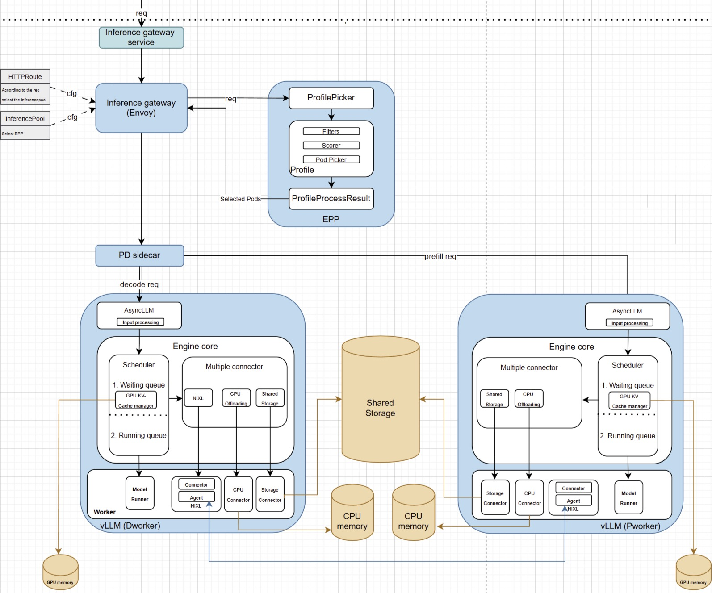
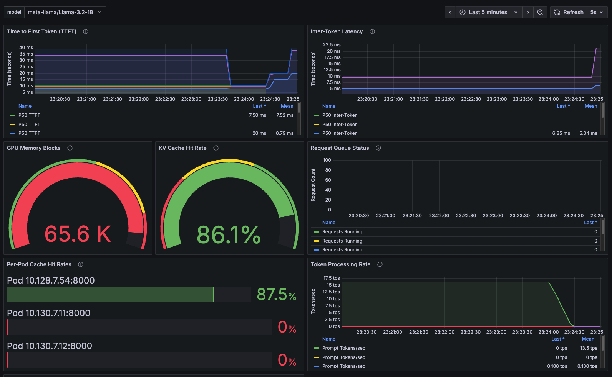

# 효율적인 AI 추론을 위해 llm-d를 사용한 KV 캐시 인식 라우팅

**목차**
1. [llm-d란](master_kv_cache_aware_routing_with_llm-d_for_efficient_ai_inference.md#1-llm-d란)<br>
2. [llm-d 배포](master_kv_cache_aware_routing_with_llm-d_for_efficient_ai_inference.md#2-llm-d-배포)<br>
3. [테스트 결과](master_kv_cache_aware_routing_with_llm-d_for_efficient_ai_inference.md#3-테스트-결과)<br>

<br>
<br>

## 1. llm-d란

### 1.1 분산 추론 서비스를 위한 **llm-d**

대규모 AI 추론 시대에는 분산 환경 전반의 효율성을 보장하는 것이 필수적입니다. 워크로드가 증가함에 따라 더욱 지능적인 스케줄링 및 메모리 재사용 전략의 필요성도 커지고 있습니다.

**llm-d**는 확장 가능하고 지능적인 LLM 추론을 위한 쿠버네티스 네이티브 프레임워크입니다. **llm-d**의 가장 강력한 기능 중 하나는 KV 캐시 인식 라우팅으로, GPU 메모리에 관련 컨텍스트가 이미 저장된 파드로 요청을 전달하여 지연 시간을 줄이고 처리량을 향상시킵니다.
<br>

### 1.2 **llm-d** 정의 및 특징

**정의**
* 클라우드 네이티브 패턴을 사용하여 대규모 LLM 추론을 관리하는 오픈 소스 프로젝트
* IBM, Google, Red Hat, 그리고 더 광범위한 AI 인프라 커뮤니티가 공동으로 추진하는 프로젝트

**특징**
* 분산된 *사전 채우기* 및 *디코딩* 워크로드
* *다중 모델* 및 다중 테넌트 격리
* 외부 처리 포드를 통한 *지능형 라우팅*
* 가장 중요한 것은 메모리 효율적이고 지연 시간이 짧은 추론을 위한 *KV 캐시 인식 라우팅*
<br>

### 1.3 상태 비저장 추론에서 캐시 재사용 실패

* 기존 배포에서는 모델 서버 내부에서 KV 캐시가 활성화되어 있더라도(예: vLLM) 게이트웨이는 캐시 상태를 인식하지 못함
* 이로 인한 문제 발생
  + 라운드 로빈 라우팅 또는 명시적 스티키 세션
  + 잦은 캐시 미스
  + 공통 접두사에 대한 반복 계산
  + 불필요한 GPU 메모리 사용
* 이러한 문제는 높은 동시성이나 대규모 공유 컨텍스트가 있는 워크로드(예: 검색 증강 생성, 에이전트, 템플릿 입력)에서 발생
<br>

### 1.4 KV 캐시 인식 라우팅

* **llm-d**는 EPP(External Processing Pod)를 갖춘 Gateway API Inference Extension(GAIE)을 도입하여 상태 인식 요청 스케줄링을 지원
* 다음 그림은 고성능 시스템이 KV 캐시 인식을 기반으로 지능적인 라우팅 결정을 내리는 것을 보여줌
  
  + 주요 구성 요소
    - **EPP(External Processing Pod)**: GAIE용으로 최적의 캐시 활용을 위해 지능적인 포드 스코어링을 조정
    - **인메모리 캐싱 시스템**: 외부 종속성 없이 vLLM 포드 전반의 캐시 상태를 추적
    - **포드 검색 및 레이블 지정 시스템**: 디코드 서비스 엔드포인트를 자동으로 식별하고 모니터링
    - **세션 인식 라우팅 알고리즘**: 최적의 캐시 재사용을 위해 요청 일관성을 유지
    - **접두사 인식 스코어링 시스템**: 즉각적인 유사성과 캐시 워먼티를 기반으로 요청을 지능적으로 라우팅
* 결과적으로 관련 캐시된 콘텐츠가 있을 가능성이 가장 높은 포드로 요청을 라우팅하는 고급 스케줄러가 생성
  + 이를 통해 추론 시간과 GPU 부하가 크게 줄어듦
<br>
<br>

## 2. llm-d 배포

### 2.1 사전 준비

* GPU 지원 노드와 NVIDIA GPU 오퍼레이터가 있는 오픈시프트 또는 쿠버네티스
* Istio 1.27.0 이상 또는 KGateway 설치(Envoy 기능 사용 시 필요)
* Gateway API CRD 설치(표준 + 추론 확장)
* 공식 커뮤니티 Helm 차트를 사용하여 llm-d 인프라 설치
* Hugging Face 토큰(모델 다운로드용)
<br>

### 2.2 구성 방식

#### 2.2.1 Helm 차트 기반

* 예제의 구현에서는 공식 llm-d 커뮤니티 Helm 차트를 사용
* Helm 차트는 다음을 자동으로 프로비저닝
  + 인프라 게이트웨이: 적절하게 구성된 게이트웨이
  + EPP: 외부 처리 포드
  + 서비스 검색: 레이블 선택기를 통한 디코딩 서비스 자동 검색
<br>

### 2.2.2 Helm 차트가 자동으로 생성 하는 InferencePool 및 InferenceModel

* EPP는 서비스 레이블을 기반으로 추론 풀을 자동으로 검색하고 관리
* 자동 검색을 위해 디코드 서비스는 다음 레이블을 가짐
  ```yaml
  llm-d.ai/inferenceServing: "true"
  ```
<br>

### 2.3 아키텍처 심층 분석

#### 2.3.1 KV 캐시 인덱서

* llm-d 지능형 라우팅 시스템의 핵심
* vLLM 기반 디코딩 및 프리필 포드 전반의 KV 캐시 블록 로컬리티에 대한 전역적이고 거의 실시간적인 뷰를 유지

#### 2.3.2 핵심 아키텍처 구성 요소

|구성 요소|목적|구현|
|:---|:---|:---|
|*`kvcache.Indexer`*|스코어링 요청을 처리하는 메인 오케스트레이터|모든 내부 모듈을 조정|
|*`kvevents.Pool`*|vLLM 포드에서 KV 캐시 이벤트를 수집|실시간 이벤트 처리를 위한 분할된 ZMQ 작업자 풀|
|*`kvblock.Index`*|블록 해시를 포드에 매핑하는 핵심 데이터 저장소|밀리초 미만 조회를 위한 메모리 내 2단계 LRU 캐시|
|*`tokenization.PrefixStore`*|토큰화된 프롬프트 접두사를 캐시|값비싼 재토큰화를 피하는 LRU 캐시|
|*`kvblock.TokenProcessor`*|토큰을 KV 블록 키로 변환|vLLM exactl과 일치하는 청킹 및 해싱 알고리즘|
|*`kvblock.Scorer`*|캐시 히트 시퀀스를 기반으로 포드 점수 매기기|가장 긴 연속 접두사 매칭 전략|

#### 2.3.3 *`read`* 경로: 지능형 파드 스코어링

* 라우터가 새 프롬프트에 가장 적합한 파드를 선택해야 할 때, *`read`* 경로는 관련 캐시된 KV 블록의 가장 긴 시퀀스를 가진 파드를 찾음
  1. 토큰 검색: `PrefixStore`에서 프롬프트 접두사에 대한 가장 긴 캐시된 토큰 시퀀스를 확인
  2. 키 생성: 토큰을 vLLM의 내부 로직과 일치하는 결정적 KV 블록 키로 변환
  3. 인덱스 조회: *`kvblock.Index`*를 쿼리하여 연속 블록을 가진 파드를 찾음
  4. 스코어링: 프롬프트 시작부터 연속적으로 일치하는 블록을 기준으로 각 파드의 순위를 매김
  5. 응답: 스코어링된 파드 순위를 라우터에 반환
* 주요 정보
  + 백그라운드 토큰화가 진행되는 동안 처음 나타나는 프롬프트는 빈 결과를 반환할 수 있지만, 일반적인 프롬프트는 밀리초 미만의 스코어링을 달성

#### 2.3.4 *`write`* 경로: 실시간 캐시 추적

*`write`* 경로는 인덱스를 실제 vLLM 포드 캐시 상태와 동기화
* 이벤트 게시: vLLM 포드는 ZMQ를 통해 캐시 이벤트(`BlockStored`, `BlockRemoved`)를 게시
* 메시지 수신: 이벤트는 토픽 형식(`kv@pod-id@model`)으로 구문 분석
* 샤딩 처리: 포드 ID는 포드별 순차적 처리를 보장하기 위해 해시됨
* 이벤트 디코딩: 워커는 이벤트 배치가 포함된 *msgpack* 페이로드를 디코딩
* 인덱스 업데이트: 캐시 변경 사항을 메모리 내 *`kvblock.Index`*에 적용
<br>

### 2.4 구성 설정

#### 2.4.1 EPP 구성 (Helm 차트 기반)

```yaml
# plugins.yaml configuration
apiVersion: v1
kind: ConfigMap
metadata:
  name: llm-d-gaie-epp-config
  namespace: llm-d
data:
  plugins-v2.yaml: |
    plugins:
      - name: "cache-aware-router"
        type: "external_processor"
        config:
          discovery:
            label_selector: "llm-d.ai/inferenceServing=true"
          cache:
            type: "in-memory-lru"
            max_size: 10000
          routing:
            algorithm: "prefix-aware"
            session_affinity: true
```

#### 2.4.2 vLLM 접두사(prefix) 캐시 구성

```yaml
args:
  - "--enable-prefix-caching"             # Enable KV-cache prefix reuse
  - "--block-size=16"                     # Optimal block size for cache efficiency
  - "--gpu-memory-utilization=0.7"        # Reserve memory for cache storage
  - "--max-model-len=4096"                # Match expected prompt lengths
  - "--kv-cache-dtype=auto"               # Automatic cache data type optimization
env:
  - name: CUDA_VISIBLE_DEVICES            # GPU assignment for cache isolation
    value: "0"
```

#### 2.4.3 EPP 통합을 위한 EnvoyFilter 구성

```yaml
name: envoy.filters.http.ext_proc
typed_config:
  grpc_service:
    envoy_grpc:
      cluster_name: epp-ext-proc-cluster  # Cluster pointing to EPP service
  processing_mode:
    request_header_mode: SEND     # Send request headers for routing analysis
    response_header_mode: SEND    # Send response headers for session tracking
    request_body_mode: STREAMED   # Stream request bodies for prompt analysis
  failure_mode_allow: true        # Continue routing if EPP unavailable
  message_timeout: 30s            # Allow time for intelligent scoring
```
<br>
<br>

## 3. 테스트 결과

### 3.1 테스트 구성

* KV 캐시 인식 라우팅이 제대로 작동하는지 확인 목적 기반
  + 반복되는 사용자 프롬프트나 템플릿 기반 문서와 같이 공유 접두사를 가진 여러 요청과 같은 일반적인 사용 패턴을 시뮬레이션하는 Tekton 파이프라인을 설계

* 모니터링 대상
  + 지능형 라우팅 결정을 위한 EPP 로그
  + 프리픽스 캐시 적중률을 위한 EPP 및 vLLM 지표
  + 종합적인 가시성을 제공하는 Grafana 대시보드
<br>

### 3.2 테스트 결과

#### 3.2.1 Grafana 대시보드 모니터링

* 최근 87.4%의 캐시 적중률 테스트에서 캐시 적중률, 요청 분포 및 시스템 성능 지표를 보여주는 Grafana 대시보드
  

* 주요 대시보드 지표
  + 캐시 적중률 타임라인: 모든 디코드 포드의 캐시 효율성을 실시간으로 시각화
  + 요청 분포: 세션 어피니티가 작동하는 모습을 보여주는 트래픽 라우팅 패턴
  + 포드 수준 성능: 개별 디코드 포드 캐시 통계 및 GPU 사용률
  + 지연 시간 지표: 캐시 적중 대비 캐시 미스에 따른 응답 시간 개선
  + 시스템 상태: 전반적인 클러스터 성능 및 리소스 사용률

* 대시보드 최신 결과
  + 세션 어피니티는 요청의 99.92%를 기본 웜(warm) 포드에 집중(뛰어난 고착성).
  + 캐시 적중률은 전체적으로 87.4%를 달성했으며, 특히 기본 포드에서 87.5%를 기록
  + GPU 메모리 사용률은 90%로 최적의 상태를 유지
  + 캐시 적중 요청의 응답 지연 시간은 400ms 미만으로 크게 개선

#### 3.2.2 측정 가능한 성능 향상 (TTFT)

* KV 캐시 인식 라우팅의 가장 즉각적이고 눈에 띄는 이점 중 하나는 TTFT(Time To First Token)의 극적인 향상
* 캐시 적중률이 추론 속도 향상으로 직접 연결되는 것을 보여줌
* 기준 성능과 캐시 인식 성능 비교
|시나리오|캐시 라우팅 없는 경우|KV 캐시 라우팅 사용|향상|
|:---|:---|:---|:---|
|Cold 추론|2,850 *ms* TTFT|2,850 *ms* TTFT|기본|
|Warm 캐시 적중|2,850 *ms* TTFT (최악의 경우)|340 *ms* TTFT|88% 빨라짐|

#### 3.2.3 결과

* 뛰어난 성능 지표
  + 총 쿼리: 4,776개
  + 총 캐시 적중률: 4,176개
  + 캐시 적중률: 87.4%(이전 86% 대비 개선)

* 트래픽 분포 분석
  + 기본 포드: 쿼리 4,772개(트래픽의 99.92%), 캐시 적중률 87.5%
  + 보조 포드: 총 쿼리 4개(장애 조치 0.08%)
<br>

### 3.3 요약 및 결론

87.4%의 캐시 적중률은 실질적인 비즈니스 가치로 전환되어 여러 주요 영역에 영향을 미칩니다.

#### 3.3.1 비용 절감

* 반복되는 프롬프트에 대한 컴퓨팅 시간이 70% 단축되면 청구되는 GPU 시간도 70% 감소
* 시간당 2달러로 10개의 GPU를 실행하는 클러스터의 경우, 중복 계산으로 하루에 336달러를 절약 가능
* 또한, 캐시 적중은 전체 추론보다 에너지를 90% 적게 사용하므로 클라우드 비용이 크게 절감

#### 3.3.2 사용자 경험

* 사용자는 캐시된 프롬프트의 경우 1초 미만의 응답 시간을 경험
  + 콜드 추론의 경우 3~5초가 소요
* 이러한 높은 처리량은 동일한 하드웨어로 3배 더 많은 동시 사용자를 지원할 수 있음을 의미

#### 3.3.3 주요 사용 사례

**엔터프라이즈 사용 사례**
* RAG 파이프라인: 문서 청크가 캐시되어 후속 질문이 즉시 처리
* 고객 지원: 일반적인 문의가 캐시되어 상담원이 더 빠르게 응답을 받을 수 있음
* 코드 생성: 템플릿 기반 프롬프트는 캐시된 컨텍스트를 재사용
* 멀티 테넌트 SaaS: 공유된 프롬프트 패턴은 모든 사용자에게 이점을 제공

#### 3.3.4 결론

**llm-d**를 활용한 KV 캐시 인식 라우팅은 대규모 언어 모델 추론 최적화에 있어 획기적인 진전을 보여줍니다. **llm-d**는 기존 KV 캐시 콘텐츠가 있는 포드로 요청을 지능적으로 전달함으로써 지연 시간을 줄이고 처리량을 향상시키며 운영 비용을 절감합니다. 87%의 캐시 적중률과 웜 캐시 적중 시 88% 더 빠른 TTFT(Test-To-Fault)를 입증한 것은 이 기술이 실제로 얼마나 큰 영향을 미치는지 보여줍니다.

RAG, 고객 지원, 코드 생성과 같이 까다로운 환경에서 LLM을 사용하는 기업을 위해 **llm-d**의 KV 캐시 인식 라우팅은 AI 인프라의 가치를 극대화하는 강력하고 확장 가능하며 효율적인 솔루션을 제공합니다.
<br>
<br>

------
[차례](/README.md)