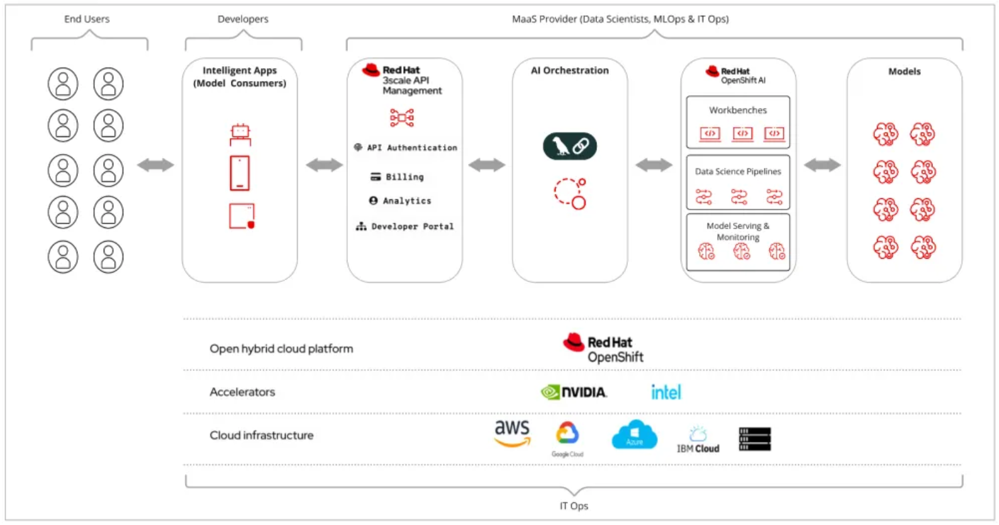
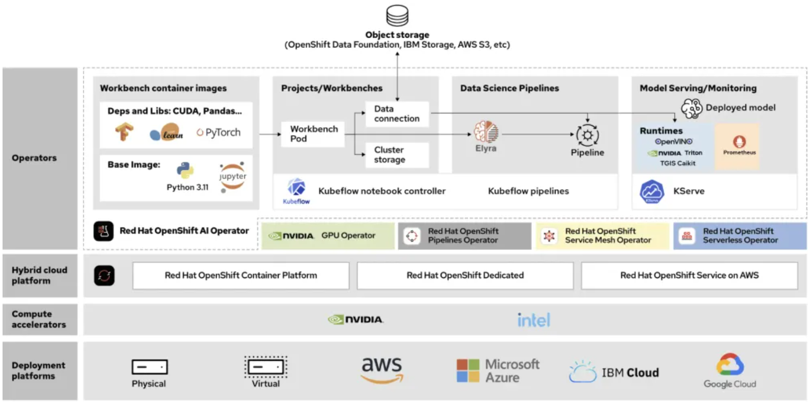
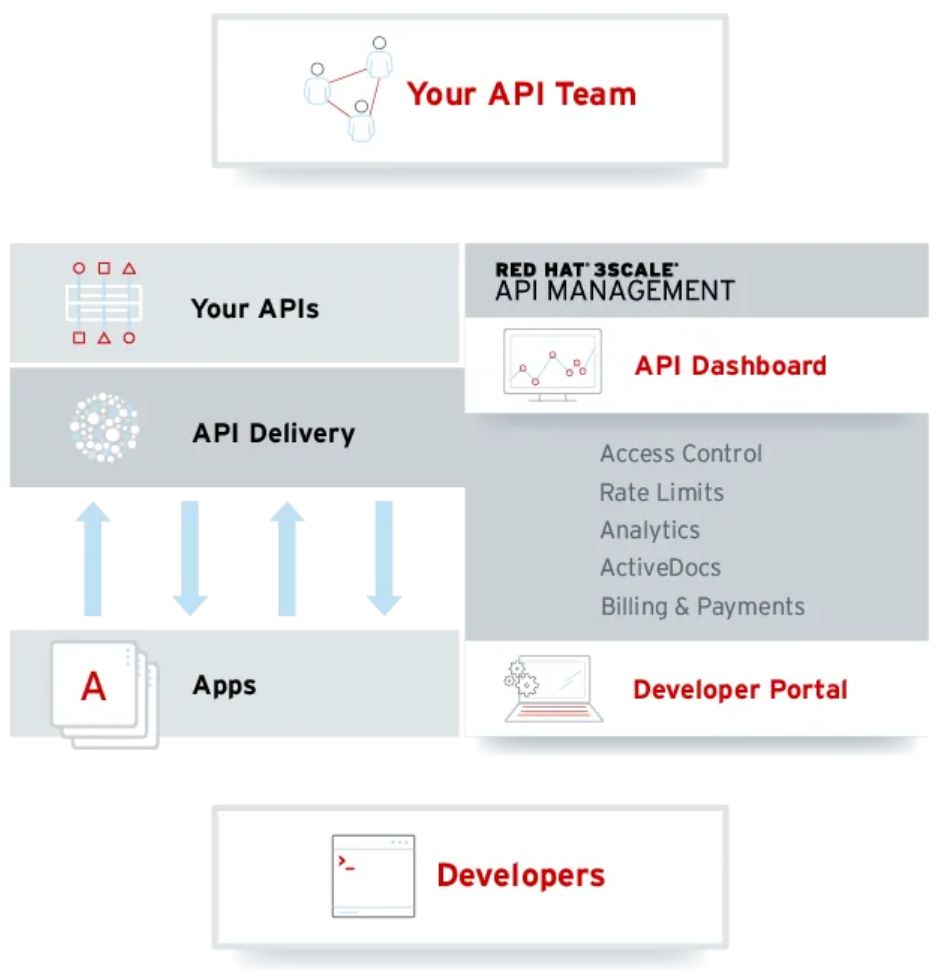

# Model-as-a-Service를 통한 AI 가치 가속화

**목차**

1. [MaaS 소개](accelerating_ai_value_with_models_as_a_service.md#1-model-as-a-service-소개) 
2. [MaaS 이해하기](accelerating_ai_value_with_models_as_a_service.md#2-maas-이해하기) 
3. [결론](accelerating_ai_value_with_models_as_a_service.md#3-결론) 

 
 

## 1. Model-as-a-Service 소개

### 1.1 MaaS란 무엇인가? 

* 서비스형 모델(MaaS)은 조직의 가치 실현 시간을 단축하고 결과를 더 빨리 제공할 수 있도록 지원
  + MaaS는 하이브리드 클라우드 AI 플랫폼의 API 게이트웨이를 통해 사전 학습된 AI 모델을 제공
* MaaS는 전문 내부 팀에서 개발 및 배포하여 조직의 다른 팀에서도 사용 가능
  + 이를 통해 다른 팀은 API를 통해 사전 학습된 모델에 액세스하여 더 빠르고 효율적으로 작업하고 전략적으로 중요한 작업에 집중
  + 신뢰할 수 있는 공급업체로부터 MaaS를 제공받을 수도 있으므로 전담 MaaS 팀을 구성할 필요가 없음
* MaaS는 효율성과 비용 절감 외에도 조직의 개인 정보 보호, 데이터 및 그 사용에 대한 제어력을 강화
 

### 1.2 MaaS는 언제 적합할까요?

* GPU와 AI 인프라를 관리하려면 AI 모델을 개발, 학습 및 관리할 수 있는 숙련된 인력이 필요
  + 단순히 AI 서비스형 인프라(IaaS)를 제공하는 대신, 조직은 소수의 숙련된 전문가를 투입하여 조직 내 누구나 사용할 수 있는 AI 모델을 개발, 학습 및 배포할 수 있음

* 모델 추론 호출에 대한 수요가 증가함에 따라, 기반 서비스 프레임워크와 GPU는 수요에 맞춰 더욱 쉽게 확장 가능
  + MaaS 제공업체는 업데이트, 성능 및 보안을 포함한 모든 인프라 유지 관리 및 모니터링 작업도 처리

* 또 다른 중요한 측면은 GPU가 비싸고 비효율적으로 사용하면 비용이 급증
  + MaaS는 인프라에 대한 막대한 투자 필요성을 줄여 기업이 이러한 초기 비용을 절감할 수 있도록 지원

* 가치 실현 시간(Time-to-Value) 또한 중요하며, MaaS는 조직의 투자 수익률(ROI)을 가속화하는 데 도움
  + 모델을 개발하고 학습하는 데는 많은 시간이 소요
  + MaaS는 모델을 사용하려는 팀이 즉시 사용할 수 있도록 함으로써 가치 실현 시간을 단축하는 데 도움
 
 

## 2. MaaS 이해하기

### 2.1 MaaS 아키텍처

#### 2.1.1 핵심 구성 요소

* 모델
* 확장 가능한 AI 플랫폼
* AI 오케스트레이션 시스템
* 강력한 API 관리

#### 2.1.2 MaaS 서비스 구성

* MaaS와 관련하여 비즈니스 사용 사례를 실제로 해결하는 AI 모델을 선택하는 것은 퍼즐의 한 조각
* 데이터 수집, 검증, 리소스 관리, 그리고 모델 배포 및 모니터링에 필요한 인프라 등 모델을 둘러싼 더 많은 요소들이 있음
* AI 애플리케이션 분야에서 이러한 활동은 머신러닝 운영(MLOps)을 통해 자동화
  + MLOps는 교차 기능 팀 내에서 DevOps와 유사한 책임을 수행하는 전체 AI 프로젝트 수명 주기를 포괄
  + MaaS 수명 주기의 경우, MaaS 제공업체는 데이터 과학자, ML 엔지니어, IT 운영을 포함한 교차 기능 분야 전문가로 구성된 유사한 팀을 보유하고 있으며, 이들은 MaaS 서비스를 제공하고 관리하기 위해 협력
 

### 2.2 모델

* MaaS 제공업체는 오픈 소스, 타사 또는 자체 모델을 통합하여 모델 카탈로그를 개발할 책임이 있음
  + 조직의 필요에 따라 MaaS 제공업체는 미세 조정과 같은 튜닝 기법을 사용하여 모델을 맞춤 설정
  + 검색 증강 생성(RAG) 또는 미세 조정을 통한 검색 증강(RAFT)을 통해 더 나은 사용자 경험을 제공
  + 튜닝이 완료되면 모델은 데이터 저장소에 저장되고, 메타 정보는 모델 레지스트리에 저장되어 서비스 제공 준비 완료

* MaaS 제공업체는 또한 사용 가능한 모든 모델의 모델 카탈로그를 구축하고, 개발자 포털에 해당 모델과 공개된 API를 문서화
 

### 2.2 레드햇 오픈시프트 AI

* MaaS의 기반은 모델을 튜닝, 제공 및 모니터링하는 데 사용되는 AI 플랫폼
  + MaaS 제공업체는 모니터링을 위한 적절한 관찰 도구를 사용하여 이 시스템을 설정할 책임이 있음
  + MaaS 제공업체는 여러 테넌트를 처리하고, 보안 위협을 모니터링 및 완화하며, 다양한 데이터 소스와 통합하여 효율적으로 모델을 제공 필요

* 레드햇 오픈시프트 AI
  
  + MaaS의 요구를 충족하고 멀티 테넌시 지원, 모델 제공을 위한 강력한 보안 태세, 데이터 서비스와의 통합 등의 기능을 제공
  + 오픈시프트 AI는 데이터 수집, 모델 학습, 모델 제공 및 관찰 워크플로를 간소화하고 팀 간의 원활한 협업을 지원

* 레드햇 오픈시프트 AI의 이점
  + 대규모 AI 워크로드의 수요를 처리할 수 있도록 효율적으로 확장 가능
  + 엣지 및 연결되지 않은 환경을 포함한 하이브리드 클라우드 전반에서 AI 워크로드 실행 가능
  + 내장된 인증 및 역할 기반 접근 제어(RBAC)
  + 다양한 제어 기능을 통해 보안 및 규정 준수 문제 해결
  + 모듈식으로 설계되어 MaaS 팀이 필요에 따라 파트너 또는 기타 오픈소스 기술을 연결하여 맞춤형 AI/ML 스택을 구축할 수 있도록 지원
 

### 2.3 AI 오케스트레이션

* 레드햇 오픈시프트 AI의 오케스트레이션 기능
  + MaaS 제공업체가 동일 모델의 다양한 버전 또는 특정 사용 사례에 대한 다양한 모델을 실험하고 더욱 효과적으로 제어할 수 있도록 기능 제공

* AI 오케스트레이션의 주요 목적
  + API 요청을 적절한 모델 인스턴스로 라우팅
  + 이 계층에는 다양한 모델 튜닝 기법을 관리하기 위한 추가 구성 요소가 포함
 

### 2.4 API 관리

* MaaS 설계에서 가장 중요한 구성 요소 중 하나
  + MaaS 제공업체는 고객이 앱을 관리 및 관찰하고 ROI를 효과적으로 측정할 수 있도록 액세스 관리, 애플리케이션 온보딩, 분석 제공 및 요금 청구 기능 필요
  + API 관리 구성 요소는 광범위한 온보딩 및 사용 정책을 지원하고, 게시된 API의 사용, 과다 사용, 미사용 및 잠재적 남용에 대한 정교한 분석을 제공

* API 관리 구성 요소
  
  + 고가용성(HA), 트래픽 제어, API 인증, 타사 ID 공급자와의 통합, 분석, 액세스 제어, 수익 창출 및 개발자 워크플로에 대한 지원을 제공
 

### 2.5 지능형 애플리케이션

* 챗봇, 모바일 애플리케이션 또는 포털과 같은 소비자 애플리케이션은 이 아키텍처의 마지막 구성 요소
  + 주요 이해 관계자는 MaaS 제공업체가 게시한 API를 통해 사용 가능한 AI 모델을 지능형 애플리케이션에 통합하려는 개발자
  + 개발자는 전용 개발자 포털을 통해 앱을 온보딩하고 API 관리 기능을 활용

* 개발자는 API를 통해 모델과 완벽하게 통합되는 지능형 애플리케이션을 최종 사용자에게 제공
  + 이를 통해 개발자는 기성 모델 API를 사용하여 비즈니스 문제 해결에 집중
  + MaaS 제공업체는 모델, MLOps 및 기반 인프라를 관리
 
 

## 3. 결론

인프라 및 데이터 과학의 복잡성을 추상화함으로써 기업은 MaaS를 활용하여 AI 솔루션을 더욱 빠르고 효율적으로 제공하는 동시에 MLOps의 비용과 복잡성을 제어할 수 있습니다.

AI 도입이 날로 증가함에 따라 MaaS는 AI 개발 및 출시 기간을 단축하는 데 매우 효과적인 방법입니다. 레드햇 오픈시프트 AI 기능을 통해 MaaS 솔루션을 구축하고 AI 투자의 잠재력을 최대한 활용할 수 있습니다.
 
 

------
[차례](/README.md)