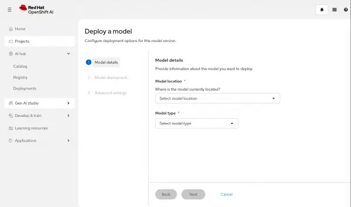
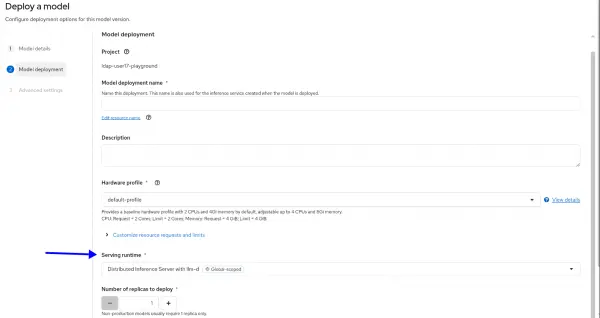
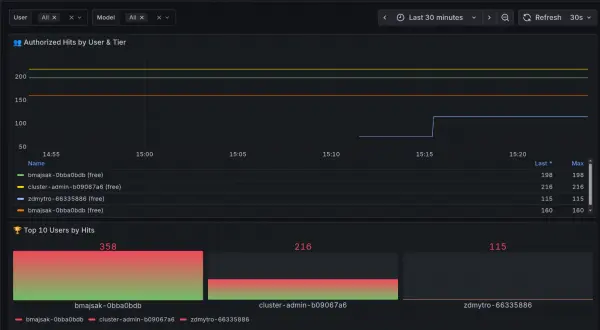

# OpenShift AI에서 Models-as-a-Service 소개

**목차**
1. [모델 서비스(MaaS)란](intro_model_as_a_service_in_openshift_ai.md#1-모델-서비스maas란)<br>
2. [MaaS 환경 구성](intro_model_as_a_service_in_openshift_ai.md#2-maas-환경-구성)<br>
3. [다음 단계](intro_model_as_a_service_in_openshift_ai.md#3-다음-단계)<br>

<br>
<br>

## 1. 모델 서비스(MaaS)란

### 1.1 MaaS 장점

* MaaS를 사용하여 조직 내 사용자가 필요에 따라 액세스할 수 있는 공유 리소스로 AI 모델을 제공
* MaaS는 표준화된 API 엔드포인트를 사용하여 바로 사용할 수 있는 AI 기반을 제공
  + 이를 통해, 조직은 대규모로 빠르고 안전한 AI를 공유하고 액세스

### 1.2 MaaS를 위한 레드햇 오픈시프트 AI

* Red Hat OpenShift AI(이하, RHOAI)는 이미 API를 통해 모델을 노출하고 공유하여 AI 모델을 실행할 수 있도록 지원
  + 하지만 대규모 사용자 기반과 모델을 공유할 경우 과도한 사용을 제한하여 서비스 품질을 유지하기 어려울 수 있음
* RHOAI 3는 레드햇의 [Connectivity Link](https://developers.redhat.com/products/red-hat-connectivity-link/overview) 기능을 활용한 모델 서비스 패턴을 도입
  + 이를 통해 RHOAI 관리자는 모델 액세스 및 사용량 제한을 더욱 효과적으로 제어
<br>
<br>

## 2. MaaS 환경 구성

### 2.1 빠른 설정

#### 2.1.1 사전 준비

* 레드햇 오픈시프트 클러스터 4.19.9 이상
* 레드햇 오픈시프트 AI 오퍼레이터 3
* 레드햇 커넥티브 링크 (Connectivity Link) 1.2
* CLI 도구들: `oc`, `kubectl`, `jq`, `kustomize`

#### 2.1.2 MaaS 인프라 배포

```bash
curl -sSLo deploy-rhoai-stable.sh https://raw.githubusercontent.com/opendatahub-io/maas-billing/refs/tags/0.0.1/deployment/scripts/deploy-rhoai-stable.sh
chmod +x deploy-rhoai-stable.sh
MAAS_REF="0.0.1" ./deploy-rhoai-stable.sh
```
* 스크립트 [deploy-rhoai-stable.sh](./files/deploy-rhoai-stable.sh)는 MaaS를 구성하는 데 필요한 환경을 구축

#### 2.1.3 배포된 환경 확인

```bash
oc describe Gateway maas-default-gateway -n openshift-ingress # View Gateway Info
oc get Gateway maas-default-gateway -n openshift-ingress -o jsonpath='{.spec.listeners[0].hostname}' # Gateway's Hostname
```
* 스크립트가 배포한 `maas-default-gateway` 이름의 Gateway 오브젝트 확인
<br>

### 2.2 샘플 모델 배포 및 속도 제한 테스트

#### 2.2.1 IBM 그라나이트 모델 배포

원격 디렉터리 상의 다음 두 개의 파일로 설정
```bash
# Deploy and immediately watch the pod status (one line)
kustomize build "https://github.com/opendatahub-io/models-as-a-service/tree/main/docs/samples/models/ibm-granite-2b-gpu" | kubectl apply -f - && kubectl get pods -n llm -w
```
* kustomization.yaml
* models.yaml

~/kustomization.yaml
```yaml
apiVersion: kustomize.config.k8s.io/v1beta1
kind: Kustomization

metadata:
  name: ibm-granite-2b-gpu

namespace: llm

namePrefix: ibm-granite-2b-gpu-

resources:
- model.yaml
```

~/models.yaml
```yaml
apiVersion: serving.kserve.io/v1alpha1
kind: LLMInferenceService
metadata:
  name: ibm-granite-2b-gpu
  namespace: llm
spec:
  model:
    uri: hf://ibm-granite/granite-3.1-2b-instruct
    name: ibm-granite/granite-3.1-2b-instruct
  replicas: 1
  router:
    route: { }
    # Connect to MaaS-enabled gateway
    gateway:
      refs:
        - name: maas-default-gateway
          namespace: openshift-ingress
  template:
    # Ensure the pod is scheduled on GPU nodes
    nodeSelector:
      nvidia.com/gpu.present: "true"
    tolerations:
      - effect: NoSchedule
        key: nvidia.com/gpu
        operator: Exists
    containers:
      - name: main
        env:
          # Granite-specific configuration via environment variables
          - name: VLLM_ADDITIONAL_ARGS
            value: "--max-model-len 4096 --trust-remote-code --dtype float16"
          - name: VLLM_ATTENTION_BACKEND
            value: XFORMERS
          - name: VLLM_USE_V1
            value: "0"
        resources:
          limits:
            cpu: '2'
            memory: 12Gi
            nvidia.com/gpu: '1'
          requests:
            cpu: '500m'
            memory: 8Gi
            nvidia.com/gpu: '1'
```

#### 2.2.2 Access Token 추출

```bash
CLUSTER_DOMAIN=$(kubectl get ingresses.config.openshift.io cluster -o jsonpath='{.spec.domain}')
TOKEN=$(curl -sSk -X POST "https://maas.${CLUSTER_DOMAIN}/maas-api/v1/tokens" \
  -H "Authorization: Bearer $(oc whoami -t)" \
  -H "Content-Type: application/json" \
  -d '{"expiration": "10m"}' | jq -r '.token')
echo "Token: ${TOKEN:0:50}..."
```

### 2.2.3 모델 호출

```bash
# List available models
curl -sSk "https://maas.${CLUSTER_DOMAIN}/maas-api/v1/models" \
  -H "Authorization: Bearer $TOKEN" | jq
# Send an inference request
curl -sSk -X POST "https://maas.${CLUSTER_DOMAIN}/llm/ibm-granite-2b-gpu/v1/chat/completions" \
  -H "Authorization: Bearer $TOKEN" \
  -H "Content-Type: application/json" \
  -d '{
    "model": "ibm-granite/granite-3.1-2b-instruct",
    "messages": [{"role": "user", "content": "Hello! What is your name?"}],
    "max_tokens": 50
  }' | jq
```
* 추출한 토큰을 통해, 모델의 endpoint를 통해 간단 테스트 진행

#### 2.2.4 티어(tier) 정보 확인

```bash
oc describe cm tier-to-group-mapping -n maas-api
```
* 티어 정보는 maas-api 네임스페이스 내의 ConfigMap에 저장

#### 2.2.5 속도 제한 확인

무료 요금제 한도를 확인
```bash
oc get TokenRateLimitPolicy gateway-token-rate-limits -n openshift-ingress -o jsonpath='{.spec.limits.free-user-tokens.rates}'
oc get RateLimitPolicy gateway-rate-limits -n openshift-ingress -o jsonpath='{.spec.limits.free.rates}'
```
* 확인된 속도 제한
  + 5 requests per 2 minutes (request-based limit)
  + 100 tokens per minute (token-based limit)

#### 2.2.6 속도 제한 테스트

실행 명령어
```bash
# Send 10 rapid requests (free tier allows only 5 per 2 minutes)
for i in {1..10}; do
  HTTP_CODE=$(curl -sSk -o /dev/null -w "%{http_code}" -X POST \
    "https://maas.${CLUSTER_DOMAIN}/llm/ibm-granite-2b-gpu/v1/chat/completions" \
    -H "Authorization: Bearer $TOKEN" \
    -H "Content-Type: application/json" \
    -d '{"model": "ibm-granite/granite-3.1-2b-instruct", "messages": [{"role": "user", "content": "Hello"}], "max_tokens": 100}')
  
  echo "Request $i: HTTP $HTTP_CODE (should be 200 for first 5)"
done
```
* 2분에 5번의 요청으로 제한된 환경에서 빠른 속도로 요청을 보냄

실행 결과
```
Request 1: HTTP 200
Request 2: HTTP 200
Request 3: HTTP 200
Request 4: HTTP 200
Request 5: HTTP 429 ← Rate limited!
Request 6: HTTP 429
Request 7: HTTP 429
Request 8: HTTP 429
Request 9: HTTP 429
Request 10: HTTP 429
```
* HTTP 429 응답은 요청 제한에 도달했음을 나타냄
* 요청 제한은 LLM(로컬 리소스 관리자)에서 보고한 총 토큰 수를 기준으로 하므로, 성공적인 요청 수는 응답 토큰 수에 따라 달라질 수 있음
* 할당량은 2분 후에 재설정되며, 이는 공정 사용 제어가 작동함을 보여줌
<br>

### 2.3 추가적인 티어 생성 및 테스트

```bash
# Edit the tier configuration to match your organization's needs: 
kubectl edit configmap tier-to-group-mapping -n maas-api

# Create premium group 
oc adm groups new premium-group 2>/dev/null 

# Add current user to premium group
CURRENT_USER=$(oc whoami)
oc adm groups add-users premium-group $CURRENT_USER

# Verify membership
oc get group premium-group
CLUSTER_DOMAIN=$(kubectl get ingresses.config.openshift.io cluster -o jsonpath='{.spec.domain}')
TOKEN=$(curl -sSk -X POST "https://maas.${CLUSTER_DOMAIN}/maas-api/v1/tokens" \
  -H "Authorization: Bearer $(oc whoami -t)" \
  -H "Content-Type: application/json" \
  -d '{"expiration": "10m"}' | jq -r '.token')

# Test PREMIUM tier (20 requests allowed)
echo "Testing PREMIUM tier (20 requests per 2 minutes):"
for i in {1..25}; do
  HTTP_CODE=$(curl -sSk -o /dev/null -w "%{http_code}" -X POST \
    "https://maas.${CLUSTER_DOMAIN}/llm/ibm-granite-2b-gpu/v1/chat/completions" \
    -H "Authorization: Bearer $TOKEN" \
    -H "Content-Type: application/json" \
    -d '{"model": "ibm-granite/granite-3.1-2b-instruct", "messages": [{"role": "user", "content": "Hi"}], "max_tokens": 5}')
  
  if [ "$HTTP_CODE" = "429" ]; then
    echo "Request $i: HTTP $HTTP_CODE ❌ (Rate limit hit)"
    break
  else
    echo "Request $i: HTTP $HTTP_CODE ✅"
  fi
done
```
* 프리미엄 그룹은 20요청을 허용함
* 프리미엄 그룹 사용자로 25개의 요청을 보냄
<br>

### 2.4 콘솔 UI를 통한 배포

#### 2.4.1 프로젝트 생성

#### 2.4.2 프로젝트 내에 **배포** 탭에서 모델 위치, 모델 유형 및 기타 중요한 정보를 지정하여 모델 배포



#### 2.4.3 MaaS는 **Serving runtime**에서만 배포할 수 있음


<br>
<br>

## 3. 다음 단계  

### 3.1 접근 제어

거버넌스 하에 샘플 모델이 포함된 MaaS 배포 환경을 구축하였다면 다음 단계로 아래 리소스를 활용할 수 있습니다.

* [티어(tier) 및 제한을 사용자 설정](https://opendatahub-io.github.io/models-as-a-service/0.0.1/configuration-and-management/tier-configuration/#1-configure-tier-mapping)
* [모델 별 접근 제어 활성화](https://opendatahub-io.github.io/models-as-a-service/0.0.1/configuration-and-management/model-setup/)
<br>

### 3.2 모니터링

RHOIA에서 모니터링를 설정


* Grafana 대시보드를 구축
* 프로메테우스 메트릭 연결 
<br>
<br>

------
[차례](/README.md)